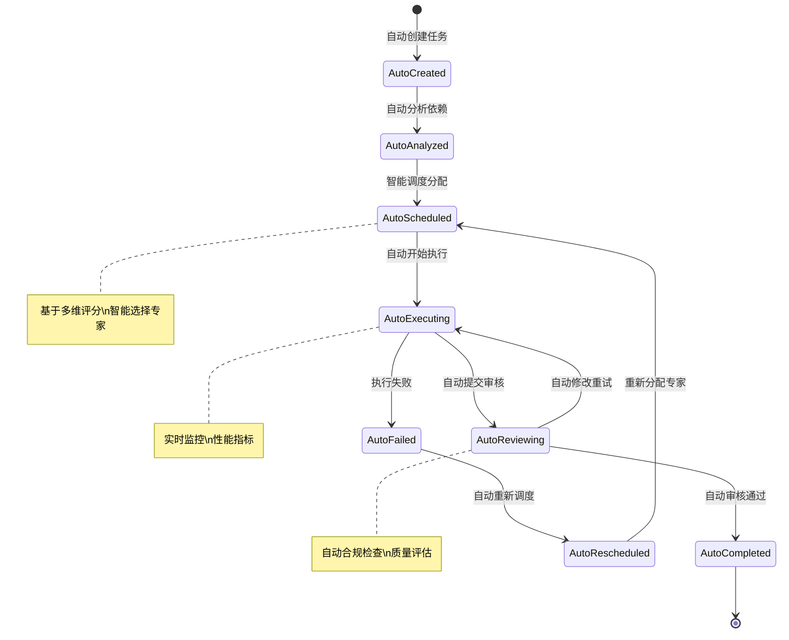

# 🏗️ Mercatus 项目规划文档

> 全自动化多智能体工作流系统 - 技术架构设计、开发规范和实现指南

## 📖 项目定位

Mercatus 作为**全自动化多智能体内容工厂的核心引擎**，专注于提供营销策略制定、内容生成和合规审核的**零人工干预**完整解决方案。

### 🎯 核心职责
- **🤖 全自动化协作** - 团队创建后自动启动完整工作流
- **🧠 智能任务调度** - 基于多维评分的专家智能分配系统
- **🔄 工作流引擎** - 自动化任务依赖管理和执行序列优化
- **📊 持续监控** - 实时性能监控、自动报警和故障恢复
- **📋 任务调度** - 基于 BlackBoard 模式的任务管理
- **🔄 消息通信** - 异步消息队列的专家间通信
- **🛡️ 多租户隔离** - 完整的团队和用户数据隔离
- **⚖️ 合规保障** - 实时的平台政策和法规检查

## 🏗️ 技术架构

### 全自动化架构核心
```
app/
├── 🔄 core/             # 自动化核心层
│   ├── auto_scheduler.py        # 智能任务调度器
│   ├── workflow_engine.py       # 工作流引擎
│   ├── dependency_manager.py    # 任务依赖管理器
│   ├── continuous_monitor.py    # 持续监控服务
│   ├── blackboard.py           # 任务调度中心
│   └── team_manager.py         # 团队管理器（集成自动化）
├── 🎯 agents/           # 智能体定义层
│   ├── planner.py      # 策略规划智能体  
│   ├── executor.py     # 内容执行智能体
│   ├── evaluator.py    # 内容评估智能体
│   └── state.py        # 状态管理
├── 👨‍💼 experts/          # 专家业务逻辑层
│   ├── plan_expert.py  # Jeff - 营销策略专家
│   ├── content_expert.py # Monica - 内容生成专家  
│   ├── review_expert.py  # Henry - 内容审核专家
│   └── prompts/        # 专家提示词库
├── 🌐 controllers/      # API 控制层（增强自动化端点）
├── 🔧 tools/            # 工具集成层
├── 📊 types/            # 数据模型层
└── ⚙️ utils/            # 工具函数层
```

### 设计模式

#### 🔄 全自动化工作流模式
- **智能调度**：多维评分算法自动分配任务给最合适专家
- **依赖管理**：自动解析任务依赖关系和关键路径分析
- **工作流引擎**：自动化工作流定义、执行和状态管理
- **持续监控**：实时监控系统健康状态和性能指标
- **自动扩展**：根据工作负载自动调整专家实例数量

#### 🏪 BlackBoard 模式（增强版）
- **智能调度**：基于专家负载和技能的自动任务分配
- **专家协作**：多个专家共享知识库和执行状态
- **动态负载均衡**：实时调整任务分配避免专家过载
- **状态同步**：实时的任务状态更新和监控

#### 🔄 消息队列模式（优化版）
- **异步通信**：非阻塞的专家间消息传递
- **可靠传输**：消息持久化和自动重试机制
- **优先级管理**：基于任务重要性和依赖关系的队列优先级
- **状态追踪**：完整的消息生命周期管理和监控

#### 🛡️ 多租户隔离（增强版）
- **团队隔离**：每个团队独立的工作空间和自动化服务
- **用户隔离**：用户级别的数据和权限隔离
- **专家实例**：团队专属的专家实例管理和自动扩展
- **资源隔离**：计算和存储资源的安全隔离

## 🤖 智能体设计

### 四层自动化架构模式

#### 🔄 Automation 层 (自动化控制)
```python
# 职责：实现全自动化工作流控制和智能调度
class AutoTaskScheduler:
    def __init__(self, team_id: str):
        self.team_id = team_id
        self.monitoring_interval = 30
        self.scoring_weights = {
            'availability': 0.4,
            'specialization': 0.3,
            'priority': 0.2,
            'performance': 0.1
        }
        
    async def intelligent_schedule(self) -> ScheduleResult:
        # 智能调度逻辑实现
        pass

class WorkflowEngine:
    def __init__(self, team_id: str):
        self.team_id = team_id
        self.workflows = {}
        self.execution_interval = 10
        
    async def auto_execute_workflows(self) -> ExecutionResult:
        # 自动化工作流执行
        pass
```

#### 🎯 Agent 层 (智能体定义)
```python
# 职责：定义智能体的核心能力和接口
class PlannerAgent:
    def __init__(self):
        self.model = get_vertex_model()
        self.tools = [search_tool, browser_tool]
        self.auto_scheduling_enabled = True
        
    async def plan(self, task: Task) -> PlanResult:
        # 规划逻辑实现，支持自动调度
        pass
```

#### 👨‍💼 Expert 层 (专家业务逻辑)
```python
# 职责：实现具体的业务逻辑和专家知识
class PlanExpert(ExpertBase):
    def __init__(self, index: int = 1):
        super().__init__(f"Jeff {index}", f"营销策略专家 {index}")
        self.auto_performance_tracking = True
        
    async def run(self, task: ExpertTask) -> Dict[str, Any]:
        # 营销策略制定逻辑，包含性能跟踪
        pass
```

#### 🧠 Core 层 (核心协调增强版)
```python
# 职责：协调多个专家，管理任务生命周期，集成自动化服务
class BlackBoard:
    def __init__(self, team_id: str):
        self.team_id = team_id
        self.experts = {}
        self.tasks = {}
        self.auto_scheduler = AutoTaskScheduler(team_id)
        self.workflow_engine = WorkflowEngine(team_id)
        
    async def auto_assign_task(self, task: Task):
        # 自动化任务分配逻辑
        pass
```

### 专家能力设计（自动化增强）

#### 🎯 Jeff (营销策略专家) - 自动化版本
```yaml
核心能力:
  - 自动市场分析: 实时目标用户画像、竞品分析、市场机会识别
  - 智能策略制定: 自动营销目标设定、渠道策略、内容策略
  - 自动资源规划: 基于历史数据的预算分配、时间规划、团队协作

自动化特性:
  - 实时数据分析: 自动收集和分析市场数据
  - 策略优化: 基于执行结果自动优化策略
  - 预测分析: AI 驱动的营销效果预测
  
输入格式:
  - 自动需求识别
  - 目标平台自动检测
  - 预算和时间约束自动评估
  
输出格式:
  - 详细营销策略文档（自动生成）
  - 内容生成指导（智能优化）
  - 执行时间表（动态调整）
```

#### ✍️ Monica (内容生成专家) - 自动化版本
```yaml
核心能力:
  - 智能内容创作: 自动文案撰写、视觉设计、视频脚本
  - 自动平台适配: 不同平台的内容格式自动优化
  - 营销技巧自动应用: 20+ 种专业营销技术的智能运用
  
自动化特性:
  - 内容自动生成: 基于策略自动创作内容
  - 质量自动评估: AI 驱动的内容质量评分
  - 性能自动优化: 基于历史表现优化内容策略
  
技巧库（自动化版本）:
  - 情境策略: 自动热点检测、节日营销、时效营销
  - 心理触发: 智能故事叙述、情感共鸣、社会认同
  - 内容结构: 自动选择列表式、案例式、数据驱动
  
输出格式:
  - 平台优化内容（自动适配）
  - 发布时间建议（智能推荐）
  - 互动策略指导（动态优化）
```

#### 🔍 Henry (内容审核专家) - 自动化版本
```yaml
核心能力:
  - 实时平台合规: 基于最新政策的自动内容检查
  - 智能法规合规: 多地区法规的自动合规性验证
  - 自动质量评估: AI 驱动的内容质量和效果预测
  
自动化特性:
  - 政策自动更新: 实时同步各平台最新政策
  - 风险自动评估: AI 预测潜在合规风险
  - 修改自动建议: 智能生成修改建议
  
检查维度（自动化版本）:
  - 平台政策: Twitter、Facebook、Reddit、Lemon8（实时更新）
  - 地区法规: 中国、美国、欧盟、其他地区（自动适配）
  - 内容质量: 准确性、相关性、吸引力（智能评分）
  
输出格式:
  - 合规性报告（自动生成）
  - 修改建议（智能推荐）
  - 风险评估（实时更新）
```

## 🔄 自动化工作流程设计

### 全自动化任务生命周期


### 全自动化专家协作流程
1. **🚀 团队创建** → 自动初始化专家实例和监控服务
2. **🔄 工作流启动** → 自动创建示例营销工作流（Jeff→Monica→Henry）
3. **📋 任务自动分析** → BlackBoard 自动接收并解析任务依赖关系
4. **🧠 智能专家分配** → AutoTaskScheduler 基于多维评分分配给最佳专家
5. **🎯 自动策略制定** → Jeff 自动分析需求并制定营销策略
6. **✍️ 自动内容生成** → Monica 自动根据策略创作内容
7. **🔍 自动内容审核** → Henry 自动检查内容合规性
8. **📊 实时性能监控** → ContinuousMonitoringService 持续监控执行状态
9. **📤 自动结果输出** → 自动返回最终的营销内容
10. **🔄 自动反馈优化** → 基于结果自动优化后续策略

## 📁 项目结构设计（自动化增强版）

### 自动化核心模块组织
```
app/
├── core/                # 🔄 自动化核心层
│   ├── __init__.py
│   ├── auto_scheduler.py        # 智能任务调度器
│   │   ├── SchedulingAlgorithm  # 多维评分算法
│   │   ├── LoadBalancer        # 负载均衡器
│   │   └── PerformanceTracker  # 性能跟踪器
│   ├── workflow_engine.py       # 工作流引擎
│   │   ├── WorkflowDefinition  # 工作流定义
│   │   ├── ExecutionEngine     # 执行引擎
│   │   └── StateManager        # 状态管理器
│   ├── dependency_manager.py    # 任务依赖管理器
│   │   ├── DependencyGraph     # 依赖图
│   │   ├── CriticalPath        # 关键路径分析
│   │   └── ConditionEvaluator  # 条件评估器
│   ├── continuous_monitor.py    # 持续监控服务
│   │   ├── HealthMonitor       # 健康监控
│   │   ├── PerformanceMetrics  # 性能指标
│   │   ├── AlertSystem         # 报警系统
│   │   └── AutoScaler          # 自动扩展
│   ├── blackboard.py           # 任务调度中心（增强版）
│   └── team_manager.py         # 团队管理器（集成自动化）
│
├── agents/              # 🎯 智能体定义
│   ├── __init__.py
│   ├── planner.py      # 策略规划Agent（自动化增强）
│   ├── executor.py     # 内容执行Agent（自动化增强）
│   ├── evaluator.py    # 内容评估Agent（自动化增强）
│   └── state.py        # 状态管理（实时同步）
│
├── experts/             # 👨‍💼 专家实现
│   ├── __init__.py
│   ├── expert.py       # 专家基类（性能跟踪增强）
│   ├── plan_expert.py  # Jeff实现（自动化策略）
│   ├── content_expert.py # Monica实现（智能创作）
│   ├── review_expert.py  # Henry实现（实时合规）
│   └── prompts/        # 提示词库
│       ├── planner_prompt.py
│       ├── content_prompt.py
│       └── review_prompt.py
│
├── controllers/         # 🌐 API控制（自动化端点）
│   ├── __init__.py
│   └── blackboard_controller.py
│       ├── /teams/{id}/workflow-status    # 工作流状态查询
│       ├── /teams/{id}/monitoring/dashboard # 实时监控面板
│       └── /teams/{id}/workflows/auto-marketing # 自动营销工作流
│
├── tools/               # 🔧 工具集成
│   ├── __init__.py
│   ├── browser.py      # 浏览器工具
│   ├── file.py         # 文件操作
│   └── search.py       # 搜索工具
│
├── types/               # 📊 数据模型（自动化类型）
│   ├── __init__.py
│   ├── blackboard.py   # BlackBoard类型
│   ├── context.py      # 上下文类型
│   ├── output.py       # 输出类型
│   ├── automation.py   # 自动化相关类型
│   │   ├── ScheduleResult      # 调度结果
│   │   ├── WorkflowStatus      # 工作流状态
│   │   ├── MonitoringMetrics   # 监控指标
│   │   └── DependencyInfo      # 依赖信息
│
├── utils/               # ⚙️ 工具函数
│   ├── __init__.py
│   └── logging.py      # 日志管理（增强监控）
│
├── clients/             # 🔌 外部客户端
│   ├── __init__.py
│   ├── redis_client.py
│   └── rocketmq_client.py
│
├── config.py            # ⚙️ 配置管理（自动化配置）
└── manager.py           # 🎮 主管理器（集成自动化服务）
```

### 文件命名规范（保持一致）
- **模块文件**：`snake_case.py` (如 `auto_scheduler.py`)
- **类名**：`PascalCase` (如 `AutoTaskScheduler`)
- **函数/变量**：`snake_case` (如 `intelligent_schedule`)
- **常量**：`UPPER_CASE` (如 `MAX_CONCURRENT_TASKS`)
- **私有方法**：`_snake_case` (如 `_calculate_expert_score`)

## 🔧 开发规范（自动化增强版）

### 自动化代码规范
```python
# ✅ 良好的自动化函数设计
async def intelligent_task_scheduling(
    available_experts: List[ExpertInfo],
    pending_tasks: List[Task],
    scoring_weights: Dict[str, float]
) -> SchedulingResult:
    """
    基于多维评分算法的智能任务调度
    
    Args:
        available_experts: 可用专家列表
        pending_tasks: 待分配任务列表  
        scoring_weights: 评分权重配置
        
    Returns:
        调度结果，包含任务分配和性能预测
        
    Raises:
        NoAvailableExpertError: 无可用专家时抛出
        InvalidScoringConfigError: 评分配置无效时抛出
    """
    # 早期验证
    if not available_experts:
        raise NoAvailableExpertError("没有可用的专家进行任务分配")
    
    # 智能调度算法
    scheduling_results = []
    for task in pending_tasks:
        best_expert = await find_best_expert(task, available_experts, scoring_weights)
        scheduling_results.append(TaskAssignment(task=task, expert=best_expert))
    
    return SchedulingResult(assignments=scheduling_results)

# ✅ 自动化监控函数设计
async def continuous_health_monitoring(
    team_id: str,
    monitoring_config: MonitoringConfig
) -> MonitoringReport:
    """
    持续健康监控和性能分析
    
    Args:
        team_id: 团队标识
        monitoring_config: 监控配置
        
    Returns:
        包含健康状态、性能指标和报警信息的监控报告
    """
    # 收集系统指标
    health_metrics = await collect_system_health(team_id)
    performance_metrics = await collect_performance_metrics(team_id)
    
    # 智能分析和报警
    alerts = await analyze_and_generate_alerts(health_metrics, performance_metrics)
    
    return MonitoringReport(
        health=health_metrics,
        performance=performance_metrics,
        alerts=alerts,
        recommendations=await generate_optimization_recommendations(team_id)
    )
```

### 自动化类型定义规范
```python
# 使用 Pydantic 进行自动化数据验证
class AutoSchedulingConfig(BaseModel):
    """自动调度配置"""
    monitoring_interval: int = Field(default=30, description="监控间隔（秒）")
    max_concurrent_tasks_per_expert: int = Field(default=5, description="每个专家最大并发任务数")
    load_balance_threshold: float = Field(default=0.8, description="负载均衡阈值")
    
    scoring_weights: Dict[str, float] = Field(
        default={
            'availability': 0.4,
            'specialization': 0.3,
            'priority': 0.2,
            'performance': 0.1
        },
        description="评分权重配置"
    )
    
    auto_scaling: AutoScalingConfig = Field(description="自动扩展配置")
    
    class Config:
        json_encoders = {
            datetime: lambda dt: dt.isoformat()
        }

class WorkflowExecutionResult(BaseModel):
    """工作流执行结果"""
    workflow_id: str = Field(description="工作流标识")
    status: WorkflowStatus = Field(description="执行状态")
    completed_tasks: List[str] = Field(description="已完成任务列表")
    pending_tasks: List[str] = Field(description="待执行任务列表")
    execution_time: float = Field(description="执行耗时（秒）")
    
    performance_metrics: Dict[str, float] = Field(description="性能指标")
    expert_utilization: Dict[str, float] = Field(description="专家利用率")
    
    auto_optimization_applied: bool = Field(default=False, description="是否应用了自动优化")
    next_execution_time: Optional[datetime] = Field(description="下次执行时间")
```

### 自动化错误处理规范
```python
# 自动化系统专用异常类
class AutomationError(Exception):
    """自动化系统基础异常类"""
    pass

class SchedulingFailedError(AutomationError):
    """任务调度失败异常"""
    def __init__(self, task_id: str, reason: str):
        self.task_id = task_id
        self.reason = reason
        super().__init__(f"Task {task_id} scheduling failed: {reason}")

class WorkflowExecutionError(AutomationError):
    """工作流执行失败异常"""
    def __init__(self, workflow_id: str, step: str, error_details: str):
        self.workflow_id = workflow_id
        self.step = step
        self.error_details = error_details
        super().__init__(f"Workflow {workflow_id} failed at step {step}: {error_details}")

# 自动化错误处理最佳实践
async def auto_execute_with_retry(task: Task, max_retries: int = 3) -> ExecutionResult:
    """带自动重试的任务执行"""
    for attempt in range(max_retries):
        try:
            result = await execute_task(task)
            
            # 自动性能监控
            await record_execution_metrics(task.task_id, result)
            
            return ExecutionResult(success=True, result=result)
            
        except SchedulingFailedError as e:
            logger.warning(f"Scheduling attempt {attempt + 1} failed: {e}")
            if attempt < max_retries - 1:
                # 自动重新调度
                await reschedule_task(task)
                continue
            else:
                # 报告最终失败
                await notify_scheduling_failure(task, e)
                return ExecutionResult(success=False, error=str(e))
                
        except Exception as e:
            logger.error(f"Unexpected error in attempt {attempt + 1}: {e}", exc_info=True)
            if attempt == max_retries - 1:
                return ExecutionResult(success=False, error=str(e))
```

### 自动化日志规范
```python
import logging
from app.utils.logging import get_automation_logger, get_performance_logger

class AutoTaskScheduler:
    def __init__(self, team_id: str):
        self.team_id = team_id
        self.logger = logging.getLogger(f"{self.__class__.__name__}")
        self.automation_logger = get_automation_logger()
        self.performance_logger = get_performance_logger()
    
    async def intelligent_schedule(self, task: Task):
        # 自动化业务日志
        self.automation_logger.logger.info(
            "开始智能任务调度",
            extra={
                'team_id': self.team_id,
                'task_id': task.task_id,
                'task_priority': task.priority.value,
                'action': 'intelligent_scheduling_start'
            }
        )
        
        # 性能监控
        with self.performance_logger.time_operation("intelligent_scheduling"):
            result = await self._execute_scheduling_algorithm(task)
            
        # 调度结果日志
        self.automation_logger.logger.info(
            f"智能调度完成: 分配给专家 {result.assigned_expert}",
            extra={
                'team_id': self.team_id,
                'task_id': task.task_id,
                'assigned_expert': result.assigned_expert,
                'scheduling_score': result.score,
                'action': 'intelligent_scheduling_complete'
            }
        )
        
        return result
```

## ⚙️ 自动化配置管理

### 环境配置（自动化增强）
```python
# app/config.py
class AutomationSettings(BaseSettings):
    """自动化系统配置"""
    
    # 核心自动化开关
    auto_workflow_enabled: bool = True
    auto_scheduling_enabled: bool = True
    continuous_monitoring_enabled: bool = True
    
    # 调度器配置
    scheduler_monitoring_interval: int = 30
    scheduler_max_concurrent_tasks: int = 5
    scheduler_load_balance_threshold: float = 0.8
    
    # 工作流引擎配置
    workflow_execution_interval: int = 10
    workflow_max_retry_attempts: int = 3
    workflow_timeout_minutes: int = 30
    
    # 监控配置
    monitoring_mode: str = "intelligent"  # passive, active, intelligent
    monitoring_check_interval: int = 10
    monitoring_metrics_retention_days: int = 30
    
    # 自动扩展配置
    auto_scaling_enabled: bool = True
    auto_scaling_min_instances: int = 1
    auto_scaling_max_instances: int = 5
    auto_scaling_scale_up_threshold: float = 0.8
    auto_scaling_scale_down_threshold: float = 0.3
    
    # LLM 配置
    google_api_key: str
    llm_temperature: float = 0.7
    max_tokens: int = 4096
    
    # Redis 配置  
    redis_url: str = "redis://localhost:6379"
    redis_max_connections: int = 10
    
    # 系统配置
    debug: bool = False
    log_level: LogLevel = LogLevel.INFO
    max_runtime_hours: int = 8
    
    class Config:
        env_file = ".env"
        env_file_encoding = "utf-8"

settings = AutomationSettings()
```

### 自动化专家配置
```yaml
# config/automation.yaml
automation:
  enabled: true
  auto_start_workflows: true
  intelligent_scheduling: true
  
scheduling:
  algorithm: "multi_dimensional_scoring"
  monitoring_interval: 30
  max_concurrent_tasks_per_expert: 5
  load_balance_threshold: 0.8
  
  scoring_weights:
    availability: 0.4
    specialization: 0.3
    priority: 0.2
    performance: 0.1
  
  auto_scaling:
    enabled: true
    min_instances_per_expert: 1
    max_instances_per_expert: 5
    scale_up_threshold: 0.8
    scale_down_threshold: 0.3

workflow_engine:
  execution_interval: 10
  max_retry_attempts: 3
  timeout_minutes: 30
  auto_restart_failed_workflows: true
  
  predefined_workflows:
    marketing_demo:
      enabled: true
      auto_create_on_team_creation: true
      steps:
        - name: "strategy_planning"
          expert_type: "jeff"
          timeout_minutes: 15
          auto_retry_on_failure: true
        - name: "content_generation"
          expert_type: "monica" 
          depends_on: ["strategy_planning"]
          timeout_minutes: 20
          auto_retry_on_failure: true
        - name: "compliance_review"
          expert_type: "henry"
          depends_on: ["content_generation"]
          timeout_minutes: 10
          auto_retry_on_failure: true

monitoring:
  enabled: true
  mode: "intelligent"
  check_interval: 10
  real_time_dashboard: true
  
  alerts:
    enabled: true
    severity_levels: ["low", "medium", "high", "critical"]
    auto_resolution: true
    notification_channels: ["log", "dashboard"]
  
  performance_tracking:
    enabled: true
    metrics_retention_days: 30
    auto_optimization: true

experts:
  jeff:
    name: "营销策略专家"
    max_instances: 2
    max_concurrent_tasks: 3
    specializations: 
      - "strategy_planning"
      - "market_analysis"
      - "budget_planning"
    auto_performance_tracking: true
    
  monica:
    name: "内容生成专家"  
    max_instances: 3
    max_concurrent_tasks: 5
    specializations:
      - "content_creation"
      - "platform_adaptation"
      - "marketing_techniques"
    auto_performance_tracking: true
    
  henry:
    name: "内容审核专家"
    max_instances: 2  
    max_concurrent_tasks: 4
    specializations:
      - "compliance_check"
      - "policy_review"
      - "quality_assessment"
    auto_performance_tracking: true
```

## 🧪 自动化测试策略

### 自动化单元测试
```python
# tests/test_automation/test_auto_scheduler.py
import pytest
from app.core.auto_scheduler import AutoTaskScheduler
from app.types.automation import SchedulingConfig, Task, ExpertInfo

class TestAutoTaskScheduler:
    @pytest.fixture
    def scheduler(self):
        config = SchedulingConfig(
            monitoring_interval=30,
            scoring_weights={
                'availability': 0.4,
                'specialization': 0.3,
                'priority': 0.2,
                'performance': 0.1
            }
        )
        return AutoTaskScheduler("test-team", config)
    
    @pytest.fixture  
    def sample_experts(self):
        return [
            ExpertInfo(id="jeff-1", type="jeff", availability=0.8, specializations=["strategy"]),
            ExpertInfo(id="monica-1", type="monica", availability=0.6, specializations=["content"]),
            ExpertInfo(id="henry-1", type="henry", availability=0.9, specializations=["review"])
        ]
    
    @pytest.fixture
    def sample_tasks(self):
        return [
            Task(id="task-1", priority="high", required_specialization="strategy"),
            Task(id="task-2", priority="medium", required_specialization="content")
        ]
    
    async def test_intelligent_scheduling_success(self, scheduler, sample_experts, sample_tasks):
        """测试智能调度成功场景"""
        result = await scheduler.intelligent_schedule(sample_tasks, sample_experts)
        
        assert result.success is True
        assert len(result.assignments) == 2
        assert result.assignments[0].task.id == "task-1"
        assert result.assignments[0].expert.type == "jeff"  # 高优先级策略任务分配给Jeff
    
    async def test_load_balancing(self, scheduler, sample_experts):
        """测试负载均衡功能"""
        # 创建大量任务测试负载均衡
        tasks = [Task(id=f"task-{i}", priority="medium", required_specialization="content") 
                for i in range(10)]
        
        result = await scheduler.intelligent_schedule(tasks, sample_experts)
        
        # 验证任务分配的均衡性
        monica_tasks = [a for a in result.assignments if a.expert.type == "monica"]
        assert len(monica_tasks) <= scheduler.config.max_concurrent_tasks_per_expert
    
    async def test_no_available_experts_error(self, scheduler):
        """测试无可用专家的错误处理"""
        tasks = [Task(id="task-1", priority="high", required_specialization="strategy")]
        
        with pytest.raises(NoAvailableExpertError):
            await scheduler.intelligent_schedule(tasks, [])
```

### 自动化集成测试
```python
# tests/test_integration/test_automation_workflow.py
class TestAutomationWorkflow:
    async def test_complete_auto_workflow(self, team_manager):
        """测试完整的自动化工作流"""
        # 1. 创建团队（应自动启动监控服务）
        team = await team_manager.create_team(
            team_name="自动化测试团队",
            organization_id="test-org",
            owner_id="test-user"
        )
        
        # 2. 验证自动化服务已启动
        monitoring_service = team_manager.get_monitoring_service(team.team_id)
        assert monitoring_service is not None
        assert monitoring_service.is_running()
        
        # 3. 验证示例工作流已创建
        workflow_status = await team_manager.get_team_workflow_status(team.team_id)
        assert workflow_status["demo_workflow_created"] is True
        
        # 4. 等待自动执行完成
        await asyncio.sleep(60)  # 等待自动化执行
        
        # 5. 验证任务自动执行结果
        final_status = await team_manager.get_team_workflow_status(team.team_id)
        assert final_status["completed_tasks"] > 0
        assert final_status["expert_utilization"]["jeff"] > 0
        
    async def test_auto_scaling(self, team_manager):
        """测试自动扩展功能"""
        team = await team_manager.create_team(
            team_name="扩展测试团队",
            organization_id="test-org", 
            owner_id="test-user"
        )
        
        # 创建大量任务触发自动扩展
        for i in range(20):
            await team_manager.submit_task(
                team_id=team.team_id,
                title=f"扩展测试任务 {i}",
                description="测试自动扩展功能",
                required_expert_role=ExpertRole.EXECUTOR
            )
        
        # 等待自动扩展触发
        await asyncio.sleep(30)
        
        # 验证专家实例数量增加
        monitoring_service = team_manager.get_monitoring_service(team.team_id)
        dashboard = await monitoring_service.get_dashboard_data()
        
        assert dashboard["auto_scaling_status"]["current_instances"]["monica"] > 1
```

### 自动化性能测试
```python
# tests/test_performance/test_automation_performance.py
class TestAutomationPerformance:
    async def test_scheduling_performance(self, scheduler):
        """测试调度性能"""
        # 创建大量专家和任务
        experts = [ExpertInfo(id=f"expert-{i}", type="monica", availability=0.8) 
                  for i in range(100)]
        tasks = [Task(id=f"task-{i}", priority="medium") for i in range(1000)]
        
        # 测量调度时间
        start_time = time.time()
        result = await scheduler.intelligent_schedule(tasks, experts)
        end_time = time.time()
        
        # 验证性能指标
        scheduling_time = end_time - start_time
        assert scheduling_time < 5.0  # 应在5秒内完成
        assert result.success is True
        assert len(result.assignments) == 1000
    
    async def test_monitoring_overhead(self, monitoring_service):
        """测试监控开销"""
        # 测量监控对系统性能的影响
        baseline_cpu = await measure_cpu_usage()
        
        # 启动监控
        await monitoring_service.start_monitoring()
        await asyncio.sleep(60)  # 运行1分钟
        
        monitoring_cpu = await measure_cpu_usage()
        
        # 验证监控开销在可接受范围内
        cpu_overhead = monitoring_cpu - baseline_cpu
        assert cpu_overhead < 0.1  # CPU开销小于10%
```

## 🚀 自动化部署配置

### Docker 配置（自动化增强）
```dockerfile
# Dockerfile.automation
FROM python:3.12-slim

WORKDIR /app

# 安装系统依赖
RUN apt-get update && apt-get install -y \
    redis-server \
    htop \
    curl \
    && rm -rf /var/lib/apt/lists/*

# 安装 Python 依赖
COPY requirements.txt .
RUN pip install --no-cache-dir -r requirements.txt

# 复制应用代码
COPY . .

# 复制自动化配置
COPY config/automation.yaml /app/config/
COPY config/monitoring.yaml /app/config/

# 暴露端口
EXPOSE 8000 6379

# 健康检查
HEALTHCHECK --interval=30s --timeout=10s --start-period=5s --retries=3 \
    CMD curl -f http://localhost:8000/health || exit 1

# 启动命令（包含自动化服务）
CMD ["sh", "-c", "redis-server --daemonize yes && python server.py --enable-automation"]
```

### Kubernetes 配置
```yaml
# k8s/automation-deployment.yaml
apiVersion: apps/v1
kind: Deployment
metadata:
  name: mercatus-automation
  labels:
    app: mercatus
    component: automation
spec:
  replicas: 3
  selector:
    matchLabels:
      app: mercatus
      component: automation
  template:
    metadata:
      labels:
        app: mercatus
        component: automation
    spec:
      containers:
      - name: mercatus-automation
        image: mercatus:automation-latest
        ports:
        - containerPort: 8000
        env:
        - name: AUTO_WORKFLOW_ENABLED
          value: "true"
        - name: MONITORING_INTERVAL
          value: "30"
        - name: SCHEDULER_INTERVAL
          value: "10"
        resources:
          requests:
            memory: "512Mi"
            cpu: "250m"
          limits:
            memory: "1Gi"
            cpu: "500m"
        livenessProbe:
          httpGet:
            path: /health
            port: 8000
          initialDelaySeconds: 30
          periodSeconds: 10
        readinessProbe:
          httpGet:
            path: /ready
            port: 8000
          initialDelaySeconds: 5
          periodSeconds: 5
```

### 环境变量（自动化专用）
```env
# .env.automation
# 自动化核心配置
AUTO_WORKFLOW_ENABLED=true
AUTO_SCHEDULING_ENABLED=true
CONTINUOUS_MONITORING_ENABLED=true

# 调度器配置
SCHEDULER_MONITORING_INTERVAL=30
SCHEDULER_MAX_CONCURRENT_TASKS=5
SCHEDULER_LOAD_BALANCE_THRESHOLD=0.8

# 工作流引擎配置
WORKFLOW_EXECUTION_INTERVAL=10
WORKFLOW_MAX_RETRY_ATTEMPTS=3
WORKFLOW_TIMEOUT_MINUTES=30

# 监控配置
MONITORING_MODE=intelligent
MONITORING_CHECK_INTERVAL=10
MONITORING_METRICS_RETENTION_DAYS=30

# 自动扩展配置
AUTO_SCALING_ENABLED=true
AUTO_SCALING_MIN_INSTANCES=1
AUTO_SCALING_MAX_INSTANCES=5

# LLM 配置
GOOGLE_API_KEY=your_google_api_key_here

# Redis 配置
REDIS_URL=redis://localhost:6379

# 系统配置
DEBUG=false
LOG_LEVEL=info
```

## 📊 自动化监控和维护

### 自动化性能监控
```python
# 关键自动化指标监控
automation_metrics = {
    "auto_scheduling_success_rate": "自动调度成功率",
    "average_scheduling_time": "平均调度时间",
    "workflow_completion_rate": "工作流完成率", 
    "expert_utilization_balance": "专家利用率平衡度",
    "auto_scaling_frequency": "自动扩展频率",
    "monitoring_response_time": "监控响应时间",
    "alert_resolution_time": "报警处理时间",
    "system_availability": "系统可用性"
}
```

### 自动化日志管理
```bash
# 自动化日志文件结构
logs/
├── mercatus_server.log         # 主系统日志
├── automation.log             # 自动化专用日志
├── scheduling.log             # 调度系统日志
├── workflow_engine.log        # 工作流引擎日志
├── monitoring.log             # 监控系统日志
├── performance.log            # 性能监控日志
├── business.log              # 业务操作日志
└── error.log                 # 错误日志
```

### 自动化运维脚本
```bash
#!/bin/bash
# scripts/automation_health_check.sh

echo "🔍 Mercatus 自动化系统健康检查"

# 检查自动化服务状态
echo "📊 检查自动化服务状态..."
curl -s http://localhost:8000/health | jq .

# 检查调度器状态
echo "⚙️ 检查调度器状态..."
curl -s http://localhost:8000/api/v1/automation/scheduler/status | jq .

# 检查工作流引擎状态
echo "🔄 检查工作流引擎状态..."
curl -s http://localhost:8000/api/v1/automation/workflow/status | jq .

# 检查监控服务状态
echo "📈 检查监控服务状态..."
curl -s http://localhost:8000/api/v1/automation/monitoring/status | jq .

# 检查系统资源使用情况
echo "💻 检查系统资源..."
top -b -n1 | head -10

# 检查Redis连接
echo "🔗 检查Redis连接..."
redis-cli ping

echo "✅ 自动化系统健康检查完成"
```

## 🔄 版本管理（自动化增强）

### Git 工作流（自动化分支）
1. **feature/automation-\*** - 自动化功能开发分支
2. **bugfix/automation-\*** - 自动化错误修复分支  
3. **performance/automation-\*** - 自动化性能优化分支
4. **release/automation-\*** - 自动化版本发布分支
5. **main** - 主分支（包含完整自动化功能）

### 自动化版本标记
- **主版本**: 自动化架构重大变更
- **次版本**: 新自动化功能添加
- **修订版本**: 自动化错误修复和性能优化

### CI/CD 自动化
```yaml
# .github/workflows/automation.yml
name: Automation System CI/CD

on:
  push:
    branches: [ main, develop ]
    paths: [ 'app/core/**', 'config/automation.yaml' ]
  pull_request:
    branches: [ main ]

jobs:
  automation-tests:
    runs-on: ubuntu-latest
    steps:
    - uses: actions/checkout@v2
    
    - name: Setup Python
      uses: actions/setup-python@v2
      with:
        python-version: 3.12
    
    - name: Install dependencies
      run: |
        pip install -r requirements.txt
        pip install pytest pytest-asyncio
    
    - name: Run automation unit tests
      run: pytest tests/test_automation/ -v
    
    - name: Run automation integration tests
      run: pytest tests/test_integration/test_automation_workflow.py -v
    
    - name: Run automation performance tests
      run: pytest tests/test_performance/test_automation_performance.py -v
  
  automation-deployment:
    needs: automation-tests
    runs-on: ubuntu-latest
    if: github.ref == 'refs/heads/main'
    steps:
    - name: Deploy automation system
      run: |
        echo "🚀 部署自动化系统..."
        # 部署脚本
```

---

本自动化增强版规划文档将随着项目发展持续更新，确保开发团队遵循统一的全自动化架构设计和开发规范，实现真正的零人工干预营销内容工厂。