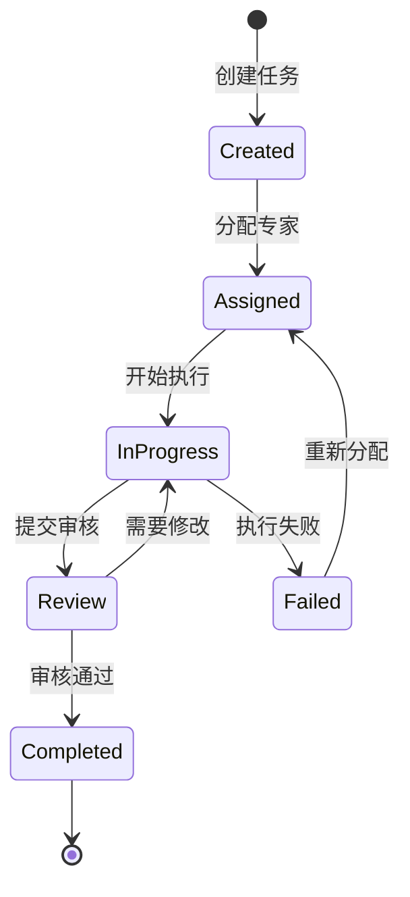

# 🏗️ Mercatus 项目规划文档

> 技术架构设计、开发规范和实现指南

## 📖 项目定位

Mercatus 作为**多智能体内容工厂的核心引擎**，专注于提供营销策略制定、内容生成和合规审核的完整解决方案。

### 🎯 核心职责
- **🤖 智能体协作** - 三个专业 AI 专家的协同工作
- **📋 任务调度** - 基于 BlackBoard 模式的任务管理
- **🔄 消息通信** - 异步消息队列的专家间通信
- **🛡️ 多租户隔离** - 完整的团队和用户数据隔离
- **⚖️ 合规保障** - 实时的平台政策和法规检查

## 🏗️ 技术架构

### 核心组件架构
```
app/
├── 🎯 agents/           # 智能体定义层
│   ├── planner.py      # 策略规划智能体  
│   ├── executor.py     # 内容执行智能体
│   ├── evaluator.py    # 内容评估智能体
│   └── state.py        # 状态管理
├── 👨‍💼 experts/          # 专家业务逻辑层
│   ├── plan_expert.py  # Jeff - 营销策略专家
│   ├── content_expert.py # Monica - 内容生成专家  
│   ├── review_expert.py  # Henry - 内容审核专家
│   └── prompts/        # 专家提示词库
├── 🧠 core/             # 核心业务层
│   ├── blackboard.py   # 任务调度中心
│   └── team_manager.py # 团队管理器
├── 🌐 controllers/      # API 控制层
├── 🔧 tools/            # 工具集成层
├── 📊 types/            # 数据模型层
└── ⚙️ utils/            # 工具函数层
```

### 设计模式

#### 🏪 BlackBoard 模式
- **中央调度**：统一的任务调度和状态管理
- **专家协作**：多个专家共享知识库
- **动态分配**：基于专家能力的智能任务分配
- **状态同步**：实时的任务状态更新

#### 🔄 消息队列模式  
- **异步通信**：非阻塞的专家间消息传递
- **可靠传输**：消息持久化和重试机制
- **优先级管理**：基于任务重要性的队列优先级
- **状态追踪**：完整的消息生命周期管理

#### 🛡️ 多租户隔离
- **团队隔离**：每个团队独立的工作空间
- **用户隔离**：用户级别的数据和权限隔离
- **专家实例**：团队专属的专家实例管理
- **资源隔离**：计算和存储资源的安全隔离

## 🤖 智能体设计

### 三层架构模式

#### 🎯 Agent 层 (智能体定义)
```python
# 职责：定义智能体的核心能力和接口
class PlannerAgent:
    def __init__(self):
        self.model = get_vertex_model()
        self.tools = [search_tool, browser_tool]
        
    async def plan(self, task: Task) -> PlanResult:
        # 规划逻辑实现
        pass
```

#### 👨‍💼 Expert 层 (专家业务逻辑)
```python
# 职责：实现具体的业务逻辑和专家知识
class PlanExpert(ExpertBase):
    def __init__(self, index: int = 1):
        super().__init__(f"Jeff {index}", f"营销策略专家 {index}")
        
    async def run(self, task: ExpertTask) -> Dict[str, Any]:
        # 营销策略制定逻辑
        pass
```

#### 🧠 Core 层 (核心协调)
```python
# 职责：协调多个专家，管理任务生命周期
class BlackBoard:
    def __init__(self, team_id: str):
        self.team_id = team_id
        self.experts = {}
        self.tasks = {}
        
    async def assign_task(self, task: Task):
        # 任务分配逻辑
        pass
```

### 专家能力设计

#### 🎯 Jeff (营销策略专家)
```yaml
核心能力:
  - 市场分析: 目标用户画像、竞品分析、市场机会识别
  - 策略制定: 营销目标设定、渠道策略、内容策略
  - 资源规划: 预算分配、时间规划、团队协作
  
输入格式:
  - 用户需求描述
  - 目标平台列表
  - 预算和时间约束
  
输出格式:
  - 详细营销策略文档
  - 内容生成指导
  - 执行时间表
```

#### ✍️ Monica (内容生成专家)
```yaml
核心能力:
  - 内容创作: 文案撰写、视觉设计、视频脚本
  - 平台适配: 不同平台的内容格式优化
  - 营销技巧: 20+ 种专业营销技术的应用
  
技巧库:
  - 情境策略: 热点营销、节日营销、时效营销
  - 心理触发: 故事叙述、情感共鸣、社会认同
  - 内容结构: 列表式、案例式、数据驱动
  
输出格式:
  - 平台优化内容
  - 发布时间建议
  - 互动策略指导
```

#### 🔍 Henry (内容审核专家)
```yaml
核心能力:
  - 平台合规: 基于最新政策的内容检查
  - 法规合规: 多地区法规的合规性验证
  - 质量评估: 内容质量和效果预测
  
检查维度:
  - 平台政策: Twitter、Facebook、Reddit、Lemon8
  - 地区法规: 中国、美国、欧盟、其他地区
  - 内容质量: 准确性、相关性、吸引力
  
输出格式:
  - 合规性报告
  - 修改建议
  - 风险评估
```

## 🔄 工作流程设计

### 任务生命周期


### 专家协作流程
1. **📝 任务创建** → BlackBoard 接收并解析任务
2. **👨‍💼 专家分配** → 根据任务类型分配给合适的专家
3. **🎯 策略制定** → Jeff 分析需求并制定营销策略
4. **✍️ 内容生成** → Monica 根据策略创作内容
5. **🔍 内容审核** → Henry 检查内容合规性
6. **📤 结果输出** → 返回最终的营销内容
7. **🔄 反馈优化** → 基于结果优化后续策略

## 📁 项目结构设计

### 核心模块组织
```
app/
├── agents/              # 🎯 智能体定义
│   ├── __init__.py
│   ├── planner.py      # 策略规划Agent
│   ├── executor.py     # 内容执行Agent
│   ├── evaluator.py    # 内容评估Agent
│   └── state.py        # 状态管理
│
├── experts/             # 👨‍💼 专家实现
│   ├── __init__.py
│   ├── expert.py       # 专家基类
│   ├── plan_expert.py  # Jeff实现
│   ├── content_expert.py # Monica实现
│   ├── review_expert.py  # Henry实现
│   └── prompts/        # 提示词库
│       ├── planner_prompt.py
│       ├── content_prompt.py
│       └── review_prompt.py
│
├── core/                # 🧠 核心业务
│   ├── __init__.py
│   ├── blackboard.py   # 任务调度中心
│   └── team_manager.py # 团队管理
│
├── controllers/         # 🌐 API控制
│   ├── __init__.py
│   └── blackboard_controller.py
│
├── tools/               # 🔧 工具集成
│   ├── __init__.py
│   ├── browser.py      # 浏览器工具
│   ├── file.py         # 文件操作
│   └── search.py       # 搜索工具
│
├── types/               # 📊 数据模型
│   ├── __init__.py
│   ├── blackboard.py   # BlackBoard类型
│   ├── context.py      # 上下文类型
│   └── output.py       # 输出类型
│
├── utils/               # ⚙️ 工具函数
│   ├── __init__.py
│   └── logging.py      # 日志管理
│
├── clients/             # 🔌 外部客户端
│   ├── __init__.py
│   ├── redis_client.py
│   └── rocketmq_client.py
│
├── config.py            # ⚙️ 配置管理
└── manager.py           # 🎮 主管理器
```

### 文件命名规范
- **模块文件**：`snake_case.py` (如 `team_manager.py`)
- **类名**：`PascalCase` (如 `TeamManager`)
- **函数/变量**：`snake_case` (如 `create_team`)
- **常量**：`UPPER_CASE` (如 `MAX_RETRIES`)
- **私有方法**：`_snake_case` (如 `_validate_input`)

## 🔧 开发规范

### 代码规范
```python
# ✅ 良好的函数设计
async def create_marketing_content(
    strategy: MarketingStrategy,
    platforms: List[Platform],
    content_types: List[ContentType]
) -> ContentGenerationResult:
    """
    根据营销策略生成多平台内容
    
    Args:
        strategy: 营销策略对象
        platforms: 目标平台列表  
        content_types: 内容类型列表
        
    Returns:
        内容生成结果，包含各平台优化内容
        
    Raises:
        InvalidStrategyError: 策略无效时抛出
        PlatformNotSupportedError: 不支持的平台
    """
    # 早期验证
    if not strategy.is_valid():
        raise InvalidStrategyError("营销策略验证失败")
    
    # 主要逻辑
    content_results = []
    for platform in platforms:
        result = await generate_platform_content(strategy, platform)
        content_results.append(result)
    
    return ContentGenerationResult(contents=content_results)
```

### 类型定义规范
```python
# 使用 Pydantic 进行数据验证
class MarketingTask(BaseModel):
    """营销任务定义"""
    task_id: str = Field(description="任务唯一标识")
    title: str = Field(description="任务标题")
    description: str = Field(description="任务描述")
    target_platforms: List[Platform] = Field(description="目标平台")
    priority: TaskPriority = Field(default=TaskPriority.MEDIUM)
    created_at: datetime = Field(default_factory=datetime.now)
    
    class Config:
        json_encoders = {
            datetime: lambda dt: dt.isoformat()
        }
```

### 错误处理规范
```python
# 自定义异常类
class MercatusError(Exception):
    """Mercatus 基础异常类"""
    pass

class ExpertNotAvailableError(MercatusError):
    """专家不可用异常"""
    def __init__(self, expert_type: str, team_id: str):
        self.expert_type = expert_type
        self.team_id = team_id
        super().__init__(f"Expert {expert_type} not available for team {team_id}")

# 错误处理最佳实践
async def assign_task_to_expert(task: Task) -> AssignmentResult:
    try:
        expert = await find_available_expert(task.required_expert_role)
        if not expert:
            raise ExpertNotAvailableError(task.required_expert_role, task.team_id)
            
        result = await expert.execute(task)
        return AssignmentResult(success=True, result=result)
        
    except ExpertNotAvailableError:
        logger.warning(f"No available expert for task {task.task_id}")
        return AssignmentResult(success=False, error="专家暂时不可用")
    except Exception as e:
        logger.error(f"Task assignment failed: {e}", exc_info=True)
        return AssignmentResult(success=False, error=str(e))
```

### 日志规范
```python
import logging
from app.utils.logging import get_performance_logger, get_business_logger

class ContentExpert:
    def __init__(self):
        self.logger = logging.getLogger(f"{self.__class__.__name__}")
        self.performance_logger = get_performance_logger()
        self.business_logger = get_business_logger()
    
    async def generate_content(self, strategy: MarketingStrategy):
        # 业务日志
        self.business_logger.logger.info(
            "开始内容生成",
            extra={
                'strategy_id': strategy.id,
                'platforms': [p.value for p in strategy.platforms],
                'action': 'content_generation_start'
            }
        )
        
        # 性能监控
        with self.performance_logger.time_operation("content_generation"):
            result = await self._do_generate_content(strategy)
            
        # 结果日志
        self.logger.info(
            f"内容生成完成: {len(result.contents)} 个内容",
            extra={
                'strategy_id': strategy.id,
                'content_count': len(result.contents),
                'action': 'content_generation_complete'
            }
        )
        
        return result
```

## ⚙️ 配置管理

### 环境配置
```python
# app/config.py
class Settings(BaseSettings):
    """系统配置"""
    
    # LLM 配置
    google_api_key: str
    llm_temperature: float = 0.7
    max_tokens: int = 4096
    
    # Redis 配置  
    redis_url: str = "redis://localhost:6379"
    redis_max_connections: int = 10
    
    # 系统配置
    debug: bool = False
    log_level: LogLevel = LogLevel.INFO
    max_runtime_hours: int = 8
    
    # 专家配置
    max_retries: int = 3
    content_quality_threshold: float = 0.8
    
    class Config:
        env_file = ".env"
        env_file_encoding = "utf-8"

settings = Settings()
```

### 专家配置
```yaml
# config/experts.yaml
experts:
  jeff:
    name: "营销策略专家"
    max_instances: 2
    max_concurrent_tasks: 3
    specializations: 
      - "strategy_planning"
      - "market_analysis"
      - "budget_planning"
    
  monica:
    name: "内容生成专家"  
    max_instances: 3
    max_concurrent_tasks: 5
    specializations:
      - "content_creation"
      - "platform_adaptation"
      - "marketing_techniques"
    
  henry:
    name: "内容审核专家"
    max_instances: 2  
    max_concurrent_tasks: 4
    specializations:
      - "compliance_check"
      - "policy_review"
      - "quality_assessment"
```

## 🧪 测试策略

### 单元测试
```python
# tests/test_experts/test_content_expert.py
import pytest
from app.experts.content_expert import ContentExpert
from app.types.output import MarketingStrategy, Platform

class TestContentExpert:
    @pytest.fixture
    def expert(self):
        return ContentExpert(index=1)
    
    @pytest.fixture  
    def sample_strategy(self):
        return MarketingStrategy(
            target_audience="25-35岁职场人士",
            key_message="提升工作效率",
            platforms=[Platform.TWITTER, Platform.FACEBOOK]
        )
    
    async def test_generate_content_success(self, expert, sample_strategy):
        """测试内容生成成功场景"""
        result = await expert.generate_content(sample_strategy)
        
        assert result.success is True
        assert len(result.contents) == 2  # 两个平台
        assert all(content.platform in sample_strategy.platforms 
                  for content in result.contents)
    
    async def test_generate_content_invalid_strategy(self, expert):
        """测试无效策略的错误处理"""
        invalid_strategy = MarketingStrategy(platforms=[])
        
        with pytest.raises(InvalidStrategyError):
            await expert.generate_content(invalid_strategy)
```

### 集成测试
```python
# tests/test_integration/test_blackboard.py
class TestBlackBoardIntegration:
    async def test_complete_workflow(self, team_manager):
        """测试完整的任务工作流"""
        # 1. 创建团队
        team = await team_manager.create_team(
            team_name="测试团队",
            organization_id="test-org",
            owner_id="test-user"
        )
        
        # 2. 提交任务
        task = await team_manager.submit_task(
            team_id=team.team_id,
            title="测试营销任务",
            description="创建产品推广内容",
            goal="提高产品知名度",
            required_expert_role=ExpertRole.PLANNER
        )
        
        # 3. 执行任务
        result = await team_manager.execute_task(team.team_id, task.task_id)
        
        # 4. 验证结果
        assert result["status"] == "completed"
        assert "result" in result
```

## 🚀 部署配置

### Docker 配置
```dockerfile
# Dockerfile
FROM python:3.12-slim

WORKDIR /app

# 安装系统依赖
RUN apt-get update && apt-get install -y \
    redis-server \
    && rm -rf /var/lib/apt/lists/*

# 安装 Python 依赖
COPY requirements.txt .
RUN pip install --no-cache-dir -r requirements.txt

# 复制应用代码
COPY . .

# 暴露端口
EXPOSE 8000

# 启动命令
CMD ["python", "server.py"]
```

### 环境变量
```env
# .env.example
# LLM 配置
GOOGLE_API_KEY=your_google_api_key_here

# Redis 配置
REDIS_URL=redis://localhost:6379

# 系统配置
DEBUG=false
LOG_LEVEL=info
MAX_RUNTIME_HOURS=8

# 专家配置
MAX_RETRIES=3
CONTENT_QUALITY_THRESHOLD=0.8

# 消息队列配置
ROCKETMQ_TOPIC_PREFIX=mercatus
```

## 📊 监控和维护

### 性能监控
```python
# 关键指标监控
metrics = {
    "task_completion_rate": "任务完成率",
    "average_response_time": "平均响应时间", 
    "expert_utilization": "专家利用率",
    "content_quality_score": "内容质量分数",
    "compliance_pass_rate": "合规通过率"
}
```

### 日志管理
```bash
# 日志文件结构
logs/
├── mercatus_server.log     # 主系统日志
├── performance.log         # 性能监控日志
├── business.log           # 业务操作日志
└── error.log              # 错误日志
```

## 🔄 版本管理

### Git 工作流
1. **feature/\*** - 新功能开发分支
2. **bugfix/\*** - 错误修复分支  
3. **release/\*** - 版本发布分支
4. **main** - 主分支（生产环境）

### 版本标记
- **主版本**: 重大架构变更
- **次版本**: 新功能添加
- **修订版本**: 错误修复

---

本文档将随着项目发展持续更新，确保开发团队遵循统一的架构设计和开发规范。