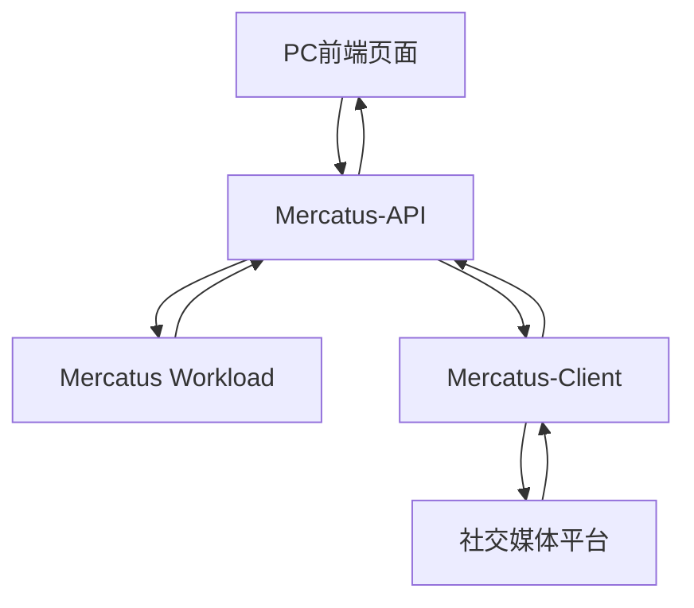

# Mercatus - Multi-Agent Content Factory

## 项目概述

Mercatus 是一个基于多智能体（Multi-Agent）的内容工厂系统，通过四个专业角色协同工作，为品牌和产品提供完整的营销内容解决方案。

## 完整应用架构

### 系统组件概览

整个Mercatus应用包含4个核心部分：

#### 1. PC前端页面 (Frontend)
- **用户界面**：提供直观的用户交互界面
- **需求输入**：用户输入营销需求和平台选择
- **内容管理**：展示生成的内容和审核状态
- **数据展示**：营销效果分析和数据可视化

#### 2. Mercatus-API (Web Service)
- **接口服务**：为前端页面提供Web API服务
- **用户管理**：处理用户认证和权限管理
- **任务调度**：协调各组件间的任务分发
- **数据聚合**：汇总来自各组件的数据

#### 3. Mercatus (本Workload)
- **Agent核心**：三个专业智能体的实现
- **内容生成**：营销策略制定和内容创作
- **合规审核**：平台政策和地区法规检查
- **浏览器隔离**：独立的用户环境管理

#### 4. Mercatus-Client (客户端)
- **内容发布**：安装在客户PC上执行内容发布
- **平台集成**：与各大社交媒体平台直接交互
- **链接回传**：回传发布后的作品链接
- **数据跟踪**：便于后续的数据跟踪分析

### 系统交互流程



1. **需求输入** → 用户通过PC前端输入营销需求
2. **API处理** → Mercatus-API接收请求并分发给Workload
3. **内容生成** → Mercatus Workload生成营销内容
4. **内容审核** → 完成平台合规和地区法规检查
5. **内容发布** → Mercatus-Client执行内容发布
6. **数据回传** → 发布链接和数据回传至API
7. **结果展示** → 前端展示发布结果和数据分析

## 应用架构详解

### 架构分层

#### Agent Workload 层 (本项目)
本项目作为**Agent的Workload**，专注于提供以下三个核心专家的实现：
- **营销策略专家（Jeff）**
- **营销内容专家（Monica）**
- **内容审查专家（Henry）**

#### 服务隔离设计
- **重服务特性**：Workload是比较重的服务，需要独立部署和管理
- **浏览器隔离**：每个用户的VNC和浏览器环境完全隔离
- **用户隔离**：确保用户间的数据和操作环境完全独立
- **独立部署**：由于隔离要求，需要独立的部署架构

#### 系统分工
- **需求分析专家（Kevin）**：由Mercatus-API提供，负责用户交互
- **Agent Workload**：本项目负责核心的营销策略、内容生成和审查功能
- **浏览器环境**：独立的VNC和浏览器实例，确保用户隔离
- **内容发布**：由Mercatus-Client负责实际的平台发布操作

## 内容平台管理

### 支持平台列表
Mercatus 提供以下内容发布平台支持：
- **X (Twitter)**：社交媒体平台
- **Facebook**：社交网络平台
- **Reddit**：社区讨论平台
- **Lemon8**：生活方式分享平台

### 平台管理特性
- **平台选择**：用户需要在开始时选择并登录目标平台
- **动态管理**：用户可以随时新增或剔除内容平台
- **登录验证**：所有内容生成任务仅限于用户已登录的平台
- **平台隔离**：每个用户的平台账户完全独立管理

### 内容类型支持
针对不同平台生成指定类型的内容：
- **文字内容**：纯文本帖子、推文、评论
- **文字+图片**：图文结合的社交媒体内容
- **视频内容**：短视频、宣传视频、教程视频

### 平台特性适配
- **X (Twitter)**：短文本、话题标签、实时互动
- **Facebook**：长文本、图片轮播、视频分享
- **Reddit**：社区讨论、问答形式、深度内容
- **Lemon8**：生活方式、图片美化、标签推荐

### 平台政策自动更新机制
- **政策URL配置**：直接配置各内容平台的政策页面URL
- **每日自动更新**：系统每天自动获取最新的平台政策
- **实时合规检查**：基于最新政策进行内容合规性验证
- **政策变更通知**：当平台政策发生变化时自动通知相关专家

#### 平台政策URL配置
```yaml
platform_policies:
  twitter:
    url: "https://help.twitter.com/en/rules-and-policies"
    content_policy: "https://help.twitter.com/en/rules-and-policies/twitter-rules"
    advertising_policy: "https://business.twitter.com/en/help/ads-policies.html"
  facebook:
    url: "https://www.facebook.com/communitystandards"
    content_policy: "https://www.facebook.com/communitystandards"
    advertising_policy: "https://www.facebook.com/policies/ads"
  reddit:
    url: "https://www.redditinc.com/policies/content-policy"
    content_policy: "https://www.redditinc.com/policies/content-policy"
    advertising_policy: "https://www.redditinc.com/policies/advertising-policy"
  lemon8:
    url: "https://www.lemon8-app.com/legal/community-guidelines"
    content_policy: "https://www.lemon8-app.com/legal/community-guidelines"
    advertising_policy: "https://www.lemon8-app.com/legal/advertising-policy"
```

## 系统架构

### 核心智能体

#### 1. 营销策划专家 Jeff (Marketing Strategy Expert)
负责制定全面的营销策略，包括目标设定、市场定位、渠道策略等。

#### 2. 内容生成专家 Monica (Content Generation Expert)  
根据营销策略执行内容创作，运用多种内容营销技巧，并针对不同平台生成适配内容。

#### 3. 内容审查专家 Henry (Content Review Expert)
确保内容符合不同地区的发布要求和法规标准，同时验证平台合规性。

### 专家交互机制

三个专家之间通过**消息队列**进行沟通，每个专家都有自己的收件箱队列和状态管理。

#### 工作流程
1. **策略制定** → 接收需求分析结果，Jeff制定营销策略
2. **平台适配** → Jeff根据用户选择的平台制定针对性策略
3. **内容创作** → Monica生成指定平台和类型的内容
4. **内容审核** → Henry基于最新平台政策审核内容合规性
5. **内容输出** → 审核通过的内容传递给Mercatus-API
6. **客户端发布** → Mercatus-Client执行实际的平台发布
7. **数据回传** → 发布链接和数据回传至系统
8. **失败处理** → 三次失败后将失败信息发送给Jeff重新生成策略

#### 消息队列架构
- **Jeff收件箱**：接收需求分析结果、平台信息和失败反馈
- **Monica收件箱**：接收营销策略、平台要求和重新生成指令
- **Henry收件箱**：接收待审核内容、平台合规要求和最新政策更新

## 计费模式

### 包含角色
- **营销策划专家（Jeff）**
- **内容生成专家（Monica）**
- **内容审查专家（Henry）**

*注：需求分析专家（Kevin）由Mercatus-API提供*

### 智能扩展机制
用户可以根据需要设置每日最大运行时长，默认最大运行时长为8小时。

## 功能模块详解

### 🎯 营销策划专家 Jeff

#### 目标设定 (Marketing Goals)
- **品牌认知** (Brand Awareness)
- **用户获取** (User Acquisition) 
- **客户留存与复购** (Retention & Repeat Purchase)
- **销售转化** (Sales Conversion)
- **用户活跃与参与度提升** (Engagement)

#### 目标用户与市场定位 (Target Audience & Positioning)
- **用户画像构建**：年龄、性别、职业、兴趣、消费能力
- **用户需求洞察**：痛点分析、需求场景识别
- **差异化定位**：与竞品的独特价值主张

#### 平台策略制定 (Platform Strategy)
- **平台选择**：根据用户已登录平台制定策略
- **内容适配**：针对不同平台特性调整内容策略
- **发布时机**：优化各平台的最佳发布时间
- **互动策略**：制定平台特定的用户互动方案
- **政策适应**：根据最新平台政策调整策略方向

#### 核心渠道策略 (Channel Strategy)

##### 1. 内容营销 (Content Marketing)
- 博客文章、白皮书、电子书
- 视频、图文、短视频
- 教程、指南类内容

##### 2. 搜索引擎营销 (SEO/SEM)
- **SEO**：自然搜索优化（关键词、结构、链接、内容质量）
- **SEM**：搜索广告投放（Google Ads、百度竞价）

##### 3. 社交媒体营销 (Social Media Marketing)
- 平台：X（Twitter）、Facebook、Reddit、Lemon8
- 策略：内容发布、互动、粉丝运营、话题营销

##### 4. 电邮营销 (Email Marketing)
- 促销邮件、欢迎邮件、行为触发邮件
- 营销自动化流程（如购物车恢复）

##### 5. KOL/KOC 影响者营销 (Influencer Marketing)
- 博主合作、达人测评、联合推广

##### 6. 联盟营销 (Affiliate Marketing)
- CPS/CPL 合作，分佣模式获取流量与转化

##### 7. 付费广告 (Paid Ads)
- 信息流广告（Facebook Ads、Twitter Ads）
- 程序化广告（DSP/RTB）
- 原生广告、视频广告、展示广告

##### 8. 线索收集与CRM整合
- 表单、落地页、聊天机器人收集潜在客户
- 集成CRM进行用户分层运营

#### 营销内容与创意策划 (Messaging & Creative)
- 品牌故事与主张
- 创意视觉/视频脚本
- A/B测试内容版本
- 行动号召（CTA）设计

#### 数据追踪与效果评估 (Tracking & Measurement)
- 埋点与用户行为追踪（Google Analytics、Heap、Mixpanel）
- 关键指标（KPI）：点击率、转化率、CAC、ROI、LTV
- 漏斗分析、归因分析、渠道对比分析

#### 预算规划与资源分配 (Budget & Allocation)
- 各渠道预算比例（如30%付费广告，20%SEO）
- 团队人力分配与外包安排

#### 迭代优化机制 (Optimization & Growth Loop)
- 持续测试与反馈（Test → Learn → Iterate）
- 用户调研与NPS跟踪
- 增长黑客手段（Growth Hacking）

### ✍️ 内容生成专家 Monica

#### 平台内容适配 (Platform Content Adaptation)

##### X (Twitter) 内容策略
- **字数限制**：280字符内的精炼表达
- **话题标签**：热门hashtag和趋势话题
- **实时互动**：快速响应和转发策略
- **内容类型**：文字、图片、视频、投票

##### Facebook 内容策略
- **长文本**：详细的产品介绍和故事叙述
- **图片轮播**：多图展示产品特性
- **视频分享**：产品演示和用户见证
- **社群互动**：评论回复和用户生成内容

##### Reddit 内容策略
- **社区规则**：遵守各subreddit的发帖规则
- **深度内容**：提供有价值的讨论和见解
- **问答形式**：AMA（Ask Me Anything）风格内容
- **社区贡献**：积极参与相关讨论

##### Lemon8 内容策略
- **生活方式**：贴近用户日常生活的内容
- **视觉美化**：高质量的图片和视频
- **标签推荐**：使用平台流行标签
- **教程指南**：实用的生活技巧分享

#### 情境策略类 (Contextual Strategies)

| 技巧 | 专业术语 | 描述 |
|------|----------|------|
| 蹭热点 | Newsjacking | 借助当前热门新闻/事件吸引关注，快速产出相关内容 |
| 节日内容 | Seasonal/Thematic Content | 围绕节日、纪念日、社会节点定制内容 |
| 时效引导 | Urgency Content | 制造紧迫感，如"限时优惠"、"趋势变化" |

#### 内容结构与格式类 (Content Format/Structure Strategies)

| 技巧 | 专业术语 | 描述 |
|------|----------|------|
| 干货技巧 | How-to Guides / Actionable Tips | 提供可执行建议、操作步骤、实用方法 |
| 分步骤结构 | Listicles | 以列表形式传达信息，易读且易于转发 |
| 对比内容 | Comparison Content | 比较不同产品/方案，帮助决策 |
| 案例拆解 | Case Study | 提供具体案例分析、成功故事或失败教训 |
| 数据说服 | Data-driven Content | 使用统计数据、图表、调研结果提升权威性 |
| 问答式内容 | FAQ / AMA Format | 以用户常见问题为结构，提升SEO与用户粘性 |

#### 心理驱动类 (Psychological Triggers in Content)

| 技巧 | 专业术语 | 描述 |
|------|----------|------|
| 故事叙述 | Storytelling | 借助故事情节引发情感共鸣与记忆强化 |
| 情感触发 | Emotional Triggering | 激发用户的情绪，驱动转发和参与 |
| 社会认同 | Social Proof | 展示用户评价、好评、使用人数等，增强信任感 |
| 认知偏差 | Cognitive Bias Framing | 利用锚定效应、损失厌恶、从众心理等 |
| 痛点聚焦 | Pain-Point Highlighting | 聚焦用户焦虑、未被满足的需求 |

#### 搜索与分发优化类 (SEO / Distribution Techniques)

| 技巧 | 专业术语 | 描述 |
|------|----------|------|
| 关键词优化 | SEO Optimization | 围绕核心关键词进行内容布局 |
| 结构化内容 | Skimmable Formatting | 使用标题、小结、粗体、分段等提升可读性 |
| 内容再利用 | Content Repurposing | 将博客改为视频、图文转短视频等 |
| 多渠道适配 | Omni-channel Content | 一套内容，适配多个平台 |
| 多语言发布 | Localization | 针对不同地区语言和文化本地化内容 |

#### 创意与互动驱动类 (Creative & Engagement Strategies)

| 技巧 | 专业术语 | 描述 |
|------|----------|------|
| 用户生成内容 | UGC (User-Generated Content) | 鼓励用户分享体验、评论、晒图 |
| 可视化内容 | Visual Storytelling / Infographics | 使用图解、动图、视频等强化视觉冲击力 |
| 模因内容 | Meme Marketing | 使用流行梗图/模因吸引年轻用户群体 |
| 参与式内容 | Interactive Content | 如投票、测试、测评、小游戏 |
| 虚拟角色叙事 | Character-driven Content | 利用品牌IP或虚构人物讲故事 |

#### 权威与信任建设类 (Trust & Authority Building)

| 技巧 | 专业术语 | 描述 |
|------|----------|------|
| 专家背书 | Expert-driven Content | 医生/工程师/资深行业从业者发布的内容 |
| 权威引用 | Cited Content / Source-backed | 引用知名媒体、学术来源或政府数据 |
| 口碑营销 | Testimonial/Review Content | 展示真实用户评价、评分、使用体验 |

### 🔍 内容审查专家 Henry

#### 审核流程
- **内容接收**：从Monica收件箱接收待审核内容
- **平台合规**：基于最新平台政策验证内容合规性
- **地区法规**：根据目标发布地区进行法规合规性检查
- **质量评估**：评估内容质量、准确性和有效性
- **审核决策**：通过/驳回/修改建议
- **内容输出**：审核通过的内容传递给API层
- **反馈机制**：三次失败后反馈给Jeff重新制定策略

#### 平台政策实时更新系统
- **每日政策抓取**：自动从配置的政策URL获取最新内容
- **政策变更检测**：智能识别政策变化和更新
- **合规规则更新**：自动更新内容审核规则
- **变更通知机制**：及时通知相关专家政策变化

#### 平台合规要求

##### X (Twitter) 合规
- **内容政策**：禁止仇恨言论、暴力威胁、误导信息
- **版权保护**：确保图片和视频的使用权限
- **广告标识**：付费推广内容需明确标识
- **字符限制**：遵守280字符限制
- **实时政策**：基于每日更新的最新Twitter政策

##### Facebook 合规
- **社区标准**：遵守Facebook社区准则
- **广告政策**：商业内容需符合广告政策
- **知识产权**：尊重第三方知识产权
- **真实性**：确保信息的准确性
- **实时政策**：基于每日更新的最新Facebook政策

##### Reddit 合规
- **社区规则**：遵守各subreddit的具体规则
- **自我推广**：避免过度的自我推广
- **垃圾内容**：确保内容有价值，非垃圾信息
- **透明度**：商业关系需要透明披露
- **实时政策**：基于每日更新的最新Reddit政策

##### Lemon8 合规
- **内容质量**：确保高质量的图片和视频
- **标签使用**：正确使用平台标签系统
- **社区准则**：遵守平台社区准则
- **商业披露**：商业合作需要明确标识
- **实时政策**：基于每日更新的最新Lemon8政策

#### 地区法规要求概览

##### 🇨🇳 中国
- **实名与来源标注**：自媒体账号需实名，AI生成内容需明确标记
- **内容真实性管理**：禁止虚构、断章取义、歪曲事实
- **政治与社会导向**：禁止涉及颠覆国家政权、民族歧视、暴力色情等内容
- **军事信息管控**：对军事类自媒体实施账号审查与内容监督
- **许可制度**：经营新闻信息服务需申请许可

##### 🇺🇸 美国
- **广告代言披露**：依FTC规定，付费推广需清晰披露赞助关系
- **平台责任原则**：平台通常受Section 230保护
- **"有害内容"限制**：禁止成人内容、仇恨言论、误导性声明等

##### 🇬🇧 英国与欧盟
- **Online Safety Act 2023**：对大型平台设立"注意义务"
- **DSA（欧盟数字服务法）**：要求平台对内容审核提供透明说明
- **假新闻与广告规则**：商业推广必须明示赞助

##### 🇻🇳 越南
- **Decree 147**：社交平台用户需实名验证，24小时内删除政府认定违法内容

##### 🇦🇪 阿联酋
- **新媒体法**：自媒体与影响者需获得媒体许可，遵守20项内容标准

##### 🇷🇺 俄罗斯
- **"外国代理人"标签法**：接收境外资金的个人与媒体需申报、贴标签
- **假新闻法**：未经官方认可传播被认定为假新闻将被处罚

#### 地区对照表

| 地区 | 身份/许可要求 | 内容限制焦点 | 平台责任机制 | 处罚手段与范围 |
|------|---------------|-------------|-------------|----------------|
| 中国 | 实名、来源、许可 | 政治敏感、虚假、谣言、暴恐等 | 平台需审核、限流、标注 | 行政罚款、账号停封、刑责 |
| 美国 | FTC披露要求 | 虚假广告、侵权内容 | Section 230；平台广告规范 | 民事诉讼、广告被拒发 |
| 英/欧盟 | 平台责任义务 | 仇恨言论、假新闻、违法内容 | 审查透明报告、快速删除机制 | 平台罚款高达亿级 |
| 越南 | 实名验证、数据本地化 | 政治异议、公民新闻 | 平台需配合政府 | 账号封锁、刑罚 |
| 阿联酋 | 媒体许可（含自由区） | 道德、安全、误导内容 | 内容前置审批可减风险 | 首犯百万迪拉姆罚款 |
| 俄罗斯 | 外国代理人标签与审计 | 批评政府、假新闻 | 实时屏蔽内容 | 重罚、账号禁用、审计限制 |

## 技术架构

### 系统组件
- **多智能体框架**：基于LangGraph的智能体协作系统
- **消息队列系统**：专家间异步通信机制
- **内容生成**：集成多种LLM模型进行内容创作
- **平台适配**：针对不同平台的内容格式化和优化
- **合规检查**：自动化的内容合规性验证
- **政策更新系统**：每日自动更新平台政策的爬虫系统
- **数据管理**：完整的内容生命周期管理
- **状态管理**：实时跟踪各专家工作状态
- **浏览器隔离**：独立的VNC和浏览器环境
- **API集成**：与Mercatus-API的数据交互接口

### 消息队列特性
- **异步通信**：专家间非阻塞式消息传递
- **状态同步**：实时更新各专家工作状态
- **失败重试**：自动重试机制和失败处理
- **消息持久化**：确保消息不丢失
- **优先级队列**：支持任务优先级管理

### 隔离特性
- **用户隔离**：每个用户独立的运行环境
- **浏览器隔离**：独立的VNC和浏览器实例
- **数据隔离**：用户数据完全隔离存储
- **进程隔离**：独立的进程空间和资源管理
- **平台隔离**：每个用户的平台账户独立管理

### 政策更新系统
- **定时任务**：每日定时执行政策更新任务
- **智能爬虫**：自动识别和提取政策变更内容
- **差异检测**：智能比较政策变化并标记重要更新
- **规则引擎**：自动将政策变化转换为合规检查规则
- **通知机制**：及时通知相关专家和用户政策变化

### 数据跟踪分析
- **发布链接收集**：从Mercatus-Client接收发布后的作品链接
- **数据聚合**：汇总各平台的发布数据和互动数据
- **效果分析**：提供营销效果的深度分析
- **反馈循环**：基于数据分析优化后续的内容策略

## 快速开始

### 环境要求
- Python 3.12+
- 消息队列系统（Redis/RabbitMQ）
- VNC服务器
- 浏览器环境
- 相关API密钥配置
- 定时任务调度器（Cron/Celery）

### 安装步骤
```bash
# 克隆项目
git clone [repository-url]

# 安装依赖
pip install -r requirements.txt

# 配置环境变量
cp .env.example .env
# 编辑.env文件，填入相关API密钥

# 配置平台政策URL
cp config/platform_policies.yaml.example config/platform_policies.yaml
# 编辑平台政策配置文件

# 运行应用
python main.py
```

### 与其他组件的集成
- **Mercatus-API集成**：配置API端点和认证信息
- **Mercatus-Client通信**：设置客户端通信协议
- **数据同步**：配置数据库连接和同步机制