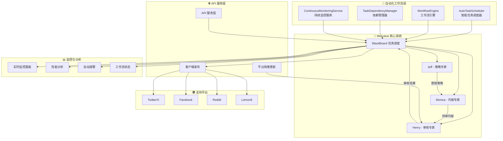

# 🏭 Mercatus - 智能营销内容自动化工厂

> 基于 AI 的全自动化营销内容生成、调度与审核系统

## 📖 项目概述

Mercatus 是一个革命性的**全自动化多智能体协作系统**，通过三个专业 AI 智能体的智能调度和无缝协作，为企业提供从营销策略制定到内容生成、再到合规审核的**零人工干预**完整营销内容解决方案。

### 🎯 核心价值
- **🤖 全自动化协作** - 团队创建后自动启动工作流，无需人工干预
- **📋 智能任务调度** - 基于专家负载、技能和优先级的智能分配系统  
- **🔄 工作流引擎** - 自动化任务依赖管理和执行序列优化
- **📊 实时监控** - 持续性能监控、自动报警和故障恢复
- **⚡ 动态扩展** - 根据工作负载自动扩展专家实例
- **🌐 多平台支持** - 支持 Twitter、Facebook、Reddit、Lemon8
- **⚖️ 实时政策更新** - 自动同步各平台最新政策要求

## ✨ 革命性特性

### 🔄 全自动化工作流系统

| 组件 | 功能 | 自动化程度 |
|------|------|-----------|
| **AutoTaskScheduler** | 智能任务调度与负载均衡 | 100% 自动 |
| **WorkflowEngine** | 工作流定义与执行管理 | 100% 自动 |
| **TaskDependencyManager** | 任务依赖关系与关键路径分析 | 100% 自动 |
| **ContinuousMonitoringService** | 实时监控与性能优化 | 100% 自动 |

### 🎯 智能调度算法
- **多维评分系统**: 专家可用性 + 技能匹配 + 任务优先级 + 历史表现
- **负载均衡**: 动态工作负载分配，避免专家过载
- **性能优化**: 基于历史数据的调度决策优化
- **故障转移**: 自动检测故障并重新分配任务

### 🤖 三大智能专家

| 专家 | 角色 | 核心能力 | 自动化功能 |
|------|------|----------|-----------|
| **Jeff** | 营销策略专家 | 制定营销目标、用户定位、渠道策略、预算规划 | 自动策略生成、市场分析 |
| **Monica** | 内容生成专家 | 创作平台适配内容、运用营销技巧、多格式输出 | 自动内容创作、平台优化 |
| **Henry** | 内容审核专家 | 平台合规检查、地区法规验证、质量评估 | 自动合规检测、风险评估 |

### 🔧 技术特性
- **🔄 零配置启动** - 团队创建即自动启动完整工作流
- **🧠 智能依赖管理** - 自动解析任务依赖关系和执行顺序
- **📊 实时监控** - 综合监控面板显示系统状态和性能指标
- **⚡ 自动扩展** - 根据工作负载自动调整专家实例数量
- **🛡️ 多租户隔离** - 完整的团队和用户隔离机制
- **📱 多平台适配** - 针对不同平台的内容优化
- **⚖️ 实时合规** - 自动更新的平台政策检查
- **🔄 故障恢复** - 自动检测和恢复失败的任务

## 🏗️ 系统架构



### 🔄 全自动化工作流程

1. **🚀 团队创建** → 自动初始化专家实例和监控服务
2. **🔄 工作流启动** → 自动创建示例营销工作流
3. **🧠 智能调度** → 自动分析任务并分配给最合适专家
4. **📋 依赖管理** → 自动解析任务依赖关系和执行顺序
5. **🎯 策略制定** → Jeff 自动分析需求并制定营销策略
6. **✍️ 内容创作** → Monica 自动根据策略生成平台适配内容
7. **🔍 合规审核** → Henry 自动检查内容的平台和法规合规性
8. **📊 实时监控** → 持续监控执行状态和性能指标
9. **📤 内容输出** → 自动返回审核通过的内容给 API 层
10. **🔄 持续优化** → 基于执行结果自动优化调度策略

## 🤖 智能体详解

### 🎯 Jeff - 营销策略专家

**核心职责**：制定全面的营销策略和执行计划

#### 自动化策略能力
- **自动目标设定**：品牌认知、用户获取、销售转化、用户留存
- **智能用户画像**：自动构建详细的目标用户画像和需求分析
- **平台策略优化**：自动针对不同社交平台制定专属策略
- **渠道规划**：自动制定内容营销、SEO/SEM、社媒营销、KOL合作方案
- **预算智能分配**：基于历史数据自动分配营销预算和资源

#### 输出内容
```json
{
  "marketing_goals": ["品牌认知提升", "用户获取"],
  "target_audience": {
    "age_range": "25-35",
    "interests": ["科技", "生活方式"],
    "pain_points": ["时间管理", "效率提升"]
  },
  "platform_strategy": {
    "twitter": "实时互动和热点营销",
    "facebook": "深度内容和社群建设"
  },
  "content_calendar": "详细的内容发布计划",
  "automation_config": {
    "schedule_frequency": "daily",
    "optimization_triggers": ["engagement_drop", "cost_increase"]
  }
}
```

### ✍️ Monica - 内容生成专家

**核心职责**：创作高质量的平台适配营销内容

#### 自动化内容能力
- **智能平台适配**：自动针对 Twitter、Facebook、Reddit、Lemon8 优化
- **营销技巧应用**：自动运用 20+ 种专业营销技巧和心理触发器
- **多格式自动生成**：文字、图文、视频等多种内容格式
- **创意自动优化**：基于历史表现数据优化创意策略

#### 自动化营销技巧库
| 类别 | 技巧示例 | 自动化程度 |
|------|----------|-----------|
| **情境策略** | 蹭热点、节日营销、时效引导 | 100% 自动检测和应用 |
| **内容结构** | 干货分享、案例拆解、数据说服 | 自动选择最佳结构 |
| **心理驱动** | 故事叙述、情感触发、社会认同 | 智能情感分析和应用 |
| **SEO优化** | 关键词布局、结构化内容 | 自动 SEO 优化 |
| **创意互动** | UGC引导、可视化内容、模因营销 | 自动创意生成 |

#### 输出内容
```json
{
  "platform_contents": [
    {
      "platform": "twitter",
      "content_type": "text_image",
      "title": "5分钟提升工作效率的神器",
      "content": "详细的推文内容...",
      "hashtags": ["#效率工具", "#生产力"],
      "optimal_posting_time": "09:00",
      "engagement_prediction": 0.85,
      "auto_optimization": {
        "a_b_variants": 3,
        "performance_tracking": true
      }
    }
  ],
  "quality_metrics": {
    "relevance_score": 0.92,
    "engagement_potential": 0.88,
    "brand_alignment": 0.95
  }
}
```

### 🔍 Henry - 内容审核专家

**核心职责**：确保内容符合平台政策和地区法规

#### 自动化审核能力
- **实时平台合规**：自动基于最新政策的合规检查
- **多地区法规检查**：自动支持中国、美国、欧盟等多地区法规
- **智能质量评估**：自动内容质量、准确性和有效性评估
- **风险预测**：AI 驱动的潜在法律和品牌风险识别

#### 支持地区
| 地区 | 主要关注点 | 自动化程度 |
|------|-----------|-----------|
| 🇨🇳 **中国** | 实名制、内容真实性、政治敏感性 | 100% 自动检测 |
| 🇺🇸 **美国** | FTC 披露要求、虚假广告限制 | 实时政策更新 |
| 🇪🇺 **欧盟** | GDPR、数字服务法、假新闻规制 | 智能合规分析 |
| 🌏 **其他** | 越南、阿联酋、俄罗斯等特殊要求 | 自动适配检查 |

#### 输出内容
```json
{
  "overall_status": "approved",
  "platform_compliance": [
    {
      "platform": "twitter",
      "status": "approved",
      "compliance_score": 0.95,
      "auto_checks_passed": 12
    }
  ],
  "regional_compliance": [
    {
      "region": "us",
      "status": "approved",
      "risk_assessment": "低风险",
      "auto_verification": true
    }
  ],
  "recommendations": ["建议添加免责声明"],
  "continuous_monitoring": {
    "policy_updates_checked": true,
    "next_review_time": "2024-01-15T10:00:00Z"
  }
}
```

## 🚀 快速开始

### 环境要求
- **Python**: 3.12+
- **Redis**: 用于消息队列和缓存
- **Google Vertex AI**: 用于 LLM 服务
- **系统**: Linux/macOS/Windows

### 安装步骤

1. **克隆项目**
```bash
git clone <repository-url>
cd mercatus
```

2. **安装依赖**
```bash
# 创建虚拟环境
python -m venv venv
source venv/bin/activate  # Windows: venv\Scripts\activate

# 安装依赖
pip install -r requirements.txt
```

3. **环境配置**
```bash
# 复制配置文件
cp .env.example .env

# 编辑配置文件
nano .env
```

4. **必要配置项**
```env
# Google Vertex AI
GOOGLE_API_KEY=your_google_api_key

# Redis 配置
REDIS_URL=redis://localhost:6379

# 自动化系统配置
AUTO_WORKFLOW_ENABLED=true
MONITORING_INTERVAL=30
SCHEDULER_INTERVAL=10

# 系统配置
DEBUG=true
LOG_LEVEL=info
```

5. **启动服务**
```bash
# 启动 Redis (如果未运行)
redis-server

# 启动 Mercatus 自动化服务
python server.py
```

6. **验证安装**
```bash
curl http://localhost:8000/health
```

## 📚 API 使用指南

### 创建团队（自动启动工作流）
```bash
curl -X POST "http://localhost:8000/api/v1/teams" \
  -H "Content-Type: application/json" \
  -H "X-User-ID: user123" \
  -d '{
    "team_name": "我的营销团队",
    "organization_id": "org-001", 
    "owner_username": "admin"
  }'

# 响应将包含自动启动的工作流信息
{
  "team_id": "team-uuid",
  "team_name": "我的营销团队",
  "auto_workflow_started": true,
  "monitoring_service_active": true,
  "demo_workflow_created": true
}
```

### 创建自动营销工作流
```bash
curl -X POST "http://localhost:8000/api/v1/teams/{team_id}/workflows/auto-marketing" \
  -H "Content-Type: application/json" \
  -H "X-User-ID: user123" \
  -d '{
    "project_name": "新产品发布营销",
    "project_description": "为新产品发布制定全方位营销策略",
    "target_platforms": ["twitter", "facebook"],
    "target_regions": ["us", "eu"],
    "content_types": ["text", "text_image"],
    "priority": "high",
    "auto_schedule": true
  }'
```

### 获取工作流状态
```bash
curl -X GET "http://localhost:8000/api/v1/teams/{team_id}/workflow-status" \
  -H "X-User-ID: user123"

# 响应包含详细的自动化状态
{
  "active_workflows": 2,
  "completed_tasks": 15,
  "pending_tasks": 3,
  "expert_utilization": {
    "jeff": 0.75,
    "monica": 0.85,
    "henry": 0.60
  },
  "auto_scheduling_active": true,
  "monitoring_status": "healthy"
}
```

### 实时监控面板
```bash
curl -X GET "http://localhost:8000/api/v1/teams/{team_id}/monitoring/dashboard" \
  -H "X-User-ID: user123"

# 获取实时监控数据
{
  "system_health": "healthy",
  "active_alerts": [],
  "performance_metrics": {
    "average_task_completion_time": 120,
    "success_rate": 0.98,
    "expert_load_balance": "optimal"
  },
  "auto_scaling_status": {
    "enabled": true,
    "current_instances": {"jeff": 2, "monica": 3, "henry": 2},
    "scaling_triggers": []
  }
}
```

### 获取团队分析
```bash
curl -X GET "http://localhost:8000/api/v1/teams/{team_id}/analytics" \
  -H "X-User-ID: user123"
```

## ⚙️ 自动化配置

### 智能调度配置
```yaml
# config/auto_scheduler.yaml
scheduler:
  monitoring_interval: 30  # 监控间隔（秒）
  max_concurrent_tasks_per_expert: 5
  load_balance_threshold: 0.8
  
scoring_weights:
  availability: 0.4      # 专家可用性权重
  specialization: 0.3    # 技能匹配权重  
  priority: 0.2          # 任务优先级权重
  performance: 0.1       # 历史表现权重

auto_scaling:
  enabled: true
  min_instances_per_expert: 1
  max_instances_per_expert: 5
  scale_up_threshold: 0.8
  scale_down_threshold: 0.3
```

### 工作流引擎配置
```yaml
# config/workflow_engine.yaml
workflow_engine:
  execution_interval: 10  # 执行检查间隔（秒）
  max_retry_attempts: 3
  timeout_minutes: 30
  
auto_workflows:
  marketing_demo:
    enabled: true
    auto_create_on_team_creation: true
    steps:
      - name: "strategy_planning"
        expert: "jeff"
        timeout_minutes: 15
      - name: "content_generation" 
        expert: "monica"
        depends_on: ["strategy_planning"]
        timeout_minutes: 20
      - name: "compliance_review"
        expert: "henry"
        depends_on: ["content_generation"]
        timeout_minutes: 10
```

### 监控配置
```yaml
# config/monitoring.yaml
monitoring:
  enabled: true
  mode: "intelligent"  # passive, active, intelligent
  check_interval: 10
  
alerts:
  enabled: true
  severity_levels: ["low", "medium", "high", "critical"]
  auto_resolution: true
  
performance_tracking:
  enabled: true
  metrics_retention_days: 30
  real_time_dashboard: true
```

## 🔧 开发指南

### 项目结构
```
mercatus/
├── app/
│   ├── agents/          # 智能体实现
│   ├── experts/         # 专家逻辑
│   ├── core/            # 核心组件
│   │   ├── auto_scheduler.py      # 🔄 自动任务调度器
│   │   ├── workflow_engine.py     # ⚙️ 工作流引擎
│   │   ├── dependency_manager.py  # 🔗 依赖管理器
│   │   ├── continuous_monitor.py  # 📊 持续监控服务
│   │   ├── blackboard.py         # BlackBoard 任务调度
│   │   └── team_manager.py       # 团队管理器
│   ├── types/           # 数据模型
│   └── utils/           # 工具函数
├── config/              # 配置文件
├── docs/                # 文档
├── tests/               # 测试用例
└── requirements.txt     # 依赖清单
```

### 添加新的自动化功能
1. 在 `app/core/` 中实现新的自动化组件
2. 在 `app/core/team_manager.py` 中集成新组件
3. 在 `app/controllers/blackboard_controller.py` 中添加 API 端点
4. 更新配置文件以支持新功能

### 自定义调度策略
```python
# 在 AutoTaskScheduler 中添加新的评分策略
class CustomScoringStrategy:
    def calculate_score(self, expert: ExpertInfo, task: Task) -> float:
        # 实现自定义评分逻辑
        base_score = expert.availability * 0.4
        skill_match = self.calculate_skill_match(expert, task)
        priority_bonus = task.priority.value * 0.2
        
        return base_score + skill_match + priority_bonus
```

## 📊 监控和日志

### 自动化监控指标
系统提供全面的自动化监控：
- **任务完成率**: 自动跟踪任务成功率
- **专家利用率**: 实时监控专家工作负载
- **调度效率**: 任务分配和执行效率
- **工作流健康**: 工作流执行状态和性能
- **系统性能**: CPU、内存、网络使用情况

### 日志配置
系统提供四种日志类型：
- **主日志**: `logs/mercatus_server.log` - 系统运行日志
- **性能日志**: `logs/performance.log` - 性能监控数据
- **业务日志**: `logs/business.log` - 业务操作记录
- **自动化日志**: `logs/automation.log` - 自动化系统专用日志

### 查看日志
```bash
# 实时查看主日志
tail -f logs/mercatus_server.log

# 查看自动化系统日志
tail -f logs/automation.log

# 查看性能统计
tail -f logs/performance.log

# 查看业务操作
tail -f logs/business.log
```

## 🤝 贡献指南

1. Fork 项目
2. 创建特性分支 (`git checkout -b feature/AmazingAutomation`)
3. 提交更改 (`git commit -m 'Add amazing automation feature'`)
4. 推送到分支 (`git push origin feature/AmazingAutomation`)
5. 开启 Pull Request

## 📄 许可证

本项目采用 MIT 许可证 - 查看 [LICENSE](LICENSE) 文件了解详情

## 📞 支持与联系

- **文档**: [项目文档](docs/)
- **问题反馈**: [GitHub Issues](../../issues)
- **讨论**: [GitHub Discussions](../../discussions)

---

<p align="center">
  <strong>🏭 Mercatus - 全自动化 AI 营销内容工厂，让智能化为您的营销赋能</strong>
</p>