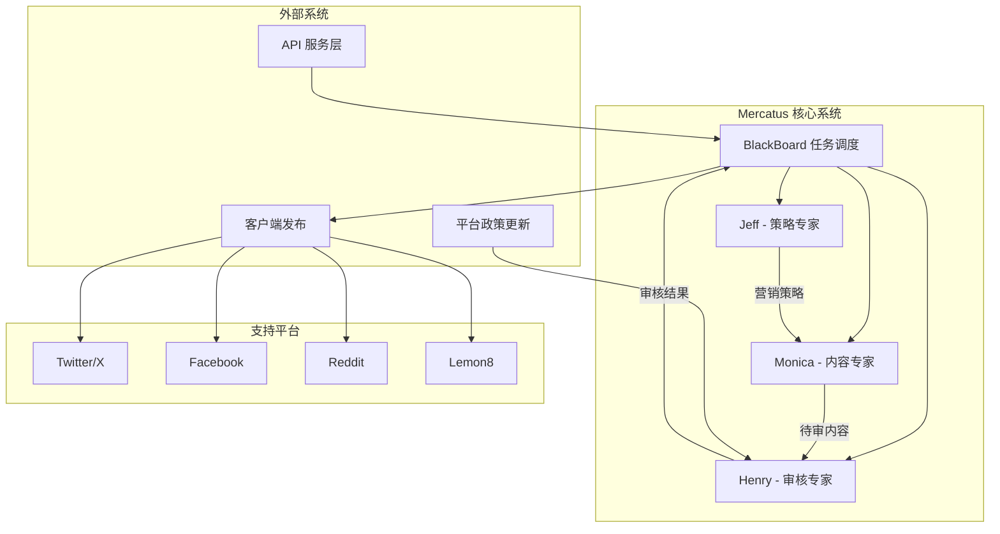

# 🏭 Mercatus - 多智能体内容工厂

> 基于 AI 的智能营销内容生成与审核系统

## 📖 项目概述

Mercatus 是一个创新的多智能体协作系统，通过三个专业 AI 智能体的无缝协作，为企业提供从营销策略制定到内容生成、再到合规审核的完整营销内容解决方案。

### 🎯 核心价值
- **📋 智能策略规划** - Jeff 专家制定精准营销策略
- **✍️ 自动内容生成** - Monica 专家创作平台适配内容  
- **🔍 合规自动审核** - Henry 专家确保内容合规发布
- **🌐 多平台支持** - 支持 Twitter、Facebook、Reddit、Lemon8
- **⚡ 实时政策更新** - 自动同步各平台最新政策要求

## ✨ 核心特性

### 🤖 三大智能专家

| 专家 | 角色 | 核心能力 |
|------|------|----------|
| **Jeff** | 营销策略专家 | 制定营销目标、用户定位、渠道策略、预算规划 |
| **Monica** | 内容生成专家 | 创作平台适配内容、运用营销技巧、多格式输出 |
| **Henry** | 内容审核专家 | 平台合规检查、地区法规验证、质量评估 |

### 🔧 技术特性
- **🔄 异步协作** - 基于消息队列的智能体通信
- **🛡️ 多租户隔离** - 完整的团队和用户隔离机制
- **📱 多平台适配** - 针对不同平台的内容优化
- **⚖️ 实时合规** - 自动更新的平台政策检查
- **📊 数据分析** - 完整的营销效果追踪

## 🏗️ 系统架构



### 🔄 工作流程

1. **📝 需求输入** → 用户通过 API 提交营销需求
2. **🎯 策略制定** → Jeff 分析需求并制定营销策略
3. **✍️ 内容创作** → Monica 根据策略生成平台适配内容
4. **🔍 合规审核** → Henry 检查内容的平台和法规合规性
5. **📤 内容输出** → 审核通过的内容返回给 API 层
6. **🚀 平台发布** → 客户端执行实际的平台发布
7. **📊 数据跟踪** → 收集发布效果数据用于优化

## 🤖 智能体详解

### 🎯 Jeff - 营销策略专家

**核心职责**：制定全面的营销策略和执行计划

#### 策略能力
- **目标设定**：品牌认知、用户获取、销售转化、用户留存
- **用户画像**：构建详细的目标用户画像和需求分析
- **平台策略**：针对不同社交平台制定专属策略
- **渠道规划**：内容营销、SEO/SEM、社媒营销、KOL合作
- **预算分配**：智能分配营销预算和资源

#### 输出内容
```json
{
  "marketing_goals": ["品牌认知提升", "用户获取"],
  "target_audience": {
    "age_range": "25-35",
    "interests": ["科技", "生活方式"],
    "pain_points": ["时间管理", "效率提升"]
  },
  "platform_strategy": {
    "twitter": "实时互动和热点营销",
    "facebook": "深度内容和社群建设"
  },
  "content_calendar": "详细的内容发布计划"
}
```

### ✍️ Monica - 内容生成专家

**核心职责**：创作高质量的平台适配营销内容

#### 内容能力
- **平台适配**：针对 Twitter、Facebook、Reddit、Lemon8 的专属优化
- **营销技巧**：运用 20+ 种专业营销技巧和心理触发器
- **多格式支持**：文字、图文、视频等多种内容格式
- **创意生成**：故事叙述、情感触发、社会认同等创意手法

#### 营销技巧库
| 类别 | 技巧示例 |
|------|----------|
| **情境策略** | 蹭热点、节日营销、时效引导 |
| **内容结构** | 干货分享、案例拆解、数据说服 |
| **心理驱动** | 故事叙述、情感触发、社会认同 |
| **SEO优化** | 关键词布局、结构化内容 |
| **创意互动** | UGC引导、可视化内容、模因营销 |

#### 输出内容
```json
{
  "platform_contents": [
    {
      "platform": "twitter",
      "content_type": "text_image",
      "title": "5分钟提升工作效率的神器",
      "content": "详细的推文内容...",
      "hashtags": ["#效率工具", "#生产力"],
      "optimal_posting_time": "09:00",
      "engagement_prediction": 0.85
    }
  ],
  "quality_metrics": {
    "relevance_score": 0.92,
    "engagement_potential": 0.88,
    "brand_alignment": 0.95
  }
}
```

### 🔍 Henry - 内容审核专家

**核心职责**：确保内容符合平台政策和地区法规

#### 审核能力
- **平台合规**：基于最新政策的自动合规检查
- **地区法规**：支持中国、美国、欧盟等多地区法规
- **质量评估**：内容质量、准确性和有效性评估
- **风险控制**：识别潜在的法律和品牌风险

#### 支持地区
| 地区 | 主要关注点 |
|------|-----------|
| 🇨🇳 **中国** | 实名制、内容真实性、政治敏感性 |
| 🇺🇸 **美国** | FTC 披露要求、虚假广告限制 |
| 🇪🇺 **欧盟** | GDPR、数字服务法、假新闻规制 |
| 🌏 **其他** | 越南、阿联酋、俄罗斯等特殊要求 |

#### 输出内容
```json
{
  "overall_status": "approved",
  "platform_compliance": [
    {
      "platform": "twitter",
      "status": "approved",
      "compliance_score": 0.95
    }
  ],
  "regional_compliance": [
    {
      "region": "us",
      "status": "approved",
      "risk_assessment": "低风险"
    }
  ],
  "recommendations": ["建议添加免责声明"]
}
```

## 🚀 快速开始

### 环境要求
- **Python**: 3.12+
- **Redis**: 用于消息队列和缓存
- **Google Vertex AI**: 用于 LLM 服务
- **系统**: Linux/macOS/Windows

### 安装步骤

1. **克隆项目**
```bash
git clone <repository-url>
cd mercatus
```

2. **安装依赖**
```bash
# 创建虚拟环境
python -m venv venv
source venv/bin/activate  # Windows: venv\Scripts\activate

# 安装依赖
pip install -r requirements.txt
```

3. **环境配置**
```bash
# 复制配置文件
cp .env.example .env

# 编辑配置文件
nano .env
```

4. **必要配置项**
```env
# Google Vertex AI
GOOGLE_API_KEY=your_google_api_key

# Redis 配置
REDIS_URL=redis://localhost:6379

# 系统配置
DEBUG=true
LOG_LEVEL=info
```

5. **启动服务**
```bash
# 启动 Redis (如果未运行)
redis-server

# 启动 Mercatus 服务
python server.py
```

6. **验证安装**
```bash
curl http://localhost:8000/health
```

## 📚 API 使用指南

### 创建团队
```bash
curl -X POST "http://localhost:8000/api/v1/teams" \
  -H "Content-Type: application/json" \
  -H "X-User-ID: user123" \
  -d '{
    "team_name": "我的营销团队",
    "organization_id": "org-001",
    "owner_username": "admin"
  }'
```

### 创建营销工作流
```bash
curl -X POST "http://localhost:8000/api/v1/teams/{team_id}/workflows/marketing" \
  -H "Content-Type: application/json" \
  -H "X-User-ID: user123" \
  -d '{
    "project_name": "新产品发布营销",
    "project_description": "为新产品发布制定全方位营销策略",
    "target_platforms": ["twitter", "facebook"],
    "target_regions": ["us", "eu"],
    "content_types": ["text", "text_image"],
    "priority": "high"
  }'
```

### 获取团队分析
```bash
curl -X GET "http://localhost:8000/api/v1/teams/{team_id}/analytics" \
  -H "X-User-ID: user123"
```

## ⚙️ 配置说明

### 智能体配置
```yaml
# config/experts.yaml
experts:
  jeff:
    max_instances: 2
    max_concurrent_tasks: 3
    specializations: ["strategy", "planning"]
    
  monica:
    max_instances: 3
    max_concurrent_tasks: 5
    specializations: ["content", "creative"]
    
  henry:
    max_instances: 2
    max_concurrent_tasks: 4
    specializations: ["compliance", "review"]
```

### 平台政策配置
```yaml
# config/platform_policies.yaml
platforms:
  twitter:
    policy_url: "https://help.twitter.com/en/rules-and-policies"
    update_frequency: "daily"
    
  facebook:
    policy_url: "https://www.facebook.com/communitystandards"
    update_frequency: "daily"
```

## 🔧 开发指南

### 项目结构
```
mercatus/
├── app/
│   ├── agents/          # 智能体实现
│   ├── experts/         # 专家逻辑
│   ├── core/            # 核心组件
│   ├── types/           # 数据模型
│   └── utils/           # 工具函数
├── config/              # 配置文件
├── docs/                # 文档
├── tests/               # 测试用例
└── requirements.txt     # 依赖清单
```

### 添加新平台支持
1. 在 `app/types/output.py` 中添加平台枚举
2. 在 `app/experts/content_expert.py` 中实现平台适配逻辑
3. 在 `app/experts/rewiew_expert.py` 中添加合规检查规则
4. 更新配置文件中的平台政策 URL

### 自定义营销技巧
```python
# 在 Monica 中添加新的营销技巧
new_technique = MarketingTechnique(
    name="新技巧名称",
    professional_term="Professional Term",
    description="技巧描述",
    platform_suitability={
        Platform.TWITTER: 0.9,
        Platform.FACEBOOK: 0.7
    },
    content_structure="内容结构建议"
)
```

## 📊 监控和日志

### 日志配置
系统提供三种日志类型：
- **主日志**: `logs/mercatus_server.log` - 系统运行日志
- **性能日志**: `logs/performance.log` - 性能监控数据
- **业务日志**: `logs/business.log` - 业务操作记录

### 查看日志
```bash
# 实时查看主日志
tail -f logs/mercatus_server.log

# 查看性能统计
tail -f logs/performance.log

# 查看业务操作
tail -f logs/business.log
```

## 🤝 贡献指南

1. Fork 项目
2. 创建特性分支 (`git checkout -b feature/AmazingFeature`)
3. 提交更改 (`git commit -m 'Add some AmazingFeature'`)
4. 推送到分支 (`git push origin feature/AmazingFeature`)
5. 开启 Pull Request

## 📄 许可证

本项目采用 MIT 许可证 - 查看 [LICENSE](LICENSE) 文件了解详情

## 📞 支持与联系

- **文档**: [项目文档](docs/)
- **问题反馈**: [GitHub Issues](../../issues)
- **讨论**: [GitHub Discussions](../../discussions)

---

<p align="center">
  <strong>🏭 Mercatus - 让 AI 为您的营销赋能</strong>
</p>